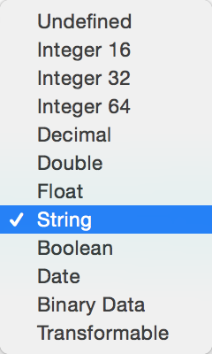
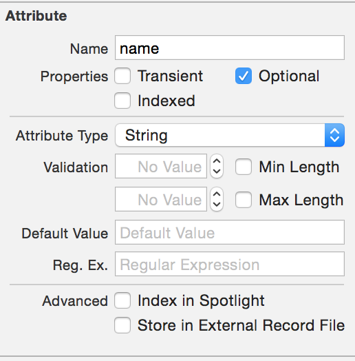

# 基本使用简介（Swift）


## 初始化

### 方法一

创建一个iOS工程，勾选Use Core Data。

工程创建完后，XCode将为我们生成一个xcdatamodeld文件用于创建实体。我们可以在这里编辑实体，并产生托管对象类。同时，XCode也在AppDelegate.Swift中添加了一些用于支持CoreData的代码。

我在这里所用的办法是通过辅助类来设置Core Data，这样的话，你就可以将这种办法运用到自己的项目中了。这也使得Core Data组件变的模块化，而且易于移植。我们将通过应用程序委托来惰性地(lazily)创建CoreDataHelper类的实例。下面就来看我们的方法二

### 方法二

这种实例可用来完成下列事项：
1、初始化托管对象模型
2、根据托管对象模型来创建持久化存储区，并据此初始化持久化存储协调器
3、根据化持久化存储协调器来初始化托管对象上下文

我们先创建CoreDataHelper.Swift文件，并且将Subclass类名为CoreDataHelper。

#### 实现CoreDataHelper类

```
import CoreData
class CoreDataHelper:NSObject {
  // MARK: - Core Data stack

    // 这个目录用来存放应用程序Core Data存储文件，在当前事例中，会在应用程序的Document目录下生成名为“FoodPin.Coredata”文件。
    lazy var applicationDocumentsDirectory: NSURL = {
        let urls = NSFileManager.defaultManager().URLsForDirectory(.DocumentDirectory, inDomains: .UserDomainMask)
        return urls[urls.count-1] as! NSURL
        }()
// 应用程序的托管对象模型。   
    lazy var managedObjectModel: NSManagedObjectModel = {

        let modelURL = NSBundle.mainBundle().URLForResource("FoodPin", withExtension: "momd")!
        return NSManagedObjectModel(contentsOfURL: modelURL)!
        }()
    //持久化协调器
    lazy var persistentStoreCoordinator: NSPersistentStoreCoordinator? = {

        var coordinator: NSPersistentStoreCoordinator? = NSPersistentStoreCoordinator(managedObjectModel: self.managedObjectModel)
        let url = self.applicationDocumentsDirectory.URLByAppendingPathComponent("FoodPin.sqlite")
        var error: NSError? = nil
        var failureReason = "There was an error creating or loading the application's saved data."
        if coordinator!.addPersistentStoreWithType(NSSQLiteStoreType, configuration: nil, URL: url, options: nil, error: &error) == nil {
            coordinator = nil
            // Report any error we got.
            let dict = NSMutableDictionary()
            dict[NSLocalizedDescriptionKey] = "Failed to initialize the application's saved data"
            dict[NSLocalizedFailureReasonErrorKey] = failureReason
            dict[NSUnderlyingErrorKey] = error
            error = NSError(domain: "YOUR_ERROR_DOMAIN", code: 9999, userInfo: dict as [NSObject : AnyObject])

            NSLog("Unresolved error \(error), \(error!.userInfo)")
            abort()
        }

        return coordinator
        }()
    //托管对象上下文
    lazy var managedObjectContext: NSManagedObjectContext? = {

        let coordinator = self.persistentStoreCoordinator
        if coordinator == nil {
            return nil
        }
        var managedObjectContext = NSManagedObjectContext()
        managedObjectContext.persistentStoreCoordinator = coordinator
        return managedObjectContext
        }()

    // MARK: - Core Data Saving support

    func saveContext () {
        if let moc = self.managedObjectContext {
            var error: NSError? = nil
            if moc.hasChanges && !moc.save(&error) {

                NSLog("Unresolved error \(error), \(error!.userInfo)")
                abort()
            }
        }
    }

}

```

我是绝对绝对不会告诉你上边的这段代码是我从**AppDelegate.Swift**中将有关**CoreData**的部分剪贴出来生成新的**CoreDataHelper**类的。

## 创建托管对象模型

`command + n`之后选择iOS中的Core Data里的**Data Model**文件，点击Next。
填写文件名称，默认名称是Model。点击Create之后在工程中就可以看到一个`.xcdatamodeld`为后缀的文件了。

### 实体

托管对象模型由一系列实体描述对象构成，这种对象就叫做实体。实体用来创建**托管对象**，有了**托管对象**之后我们可以用**Swift**代码来操作其中的数据了。

托管对象模型可以拥有一个或者多个实体，每个应用程序的实体数量会有所差别。在制作托管对象之前，首先要把每一个实体设计好。实体的设计与传统的数据库中数据表的设计是相似的。

实体的属性必须有特定的数据类型，如果想从实体中创建托管对象，那么我们通常会根据实体来创建**NSManagedObject**的子类，但这并不是强制性的。采用**NSManagedObject**的子类确实有好处，比如说可以在托管对象后面使用“点符号”来访问相关属性，这样可以让代码便于阅读。

按照下面的步骤来添加一个实体：

1、选定**Model.xcdatamodeld**
2、点击**Add Entity**
3、把实体的名称改为**Entity**

### 实体属性


选择适合的属性值在你的属性名称后边。

### 属性的各种设置选项



#### **Transient**

如果在**Properties**中勾选了这一项，那么该属性就不会写入持久化存储区了。“不写入持久化存储区”听上去有些奇怪，但是有时，只需要吧特性留在托管对象上下文里面就行了。比方说，你需要计算某个临时的值，而这种值就可以放在**transient**特性中。

#### **Optional**

Optional特性并不一定要有值。所有的特性在刚建出来的时候都是**Optional**特性。如果某一个不是**Optiona**特性，那么在把这非**Optional**特性放回存储区的时候，它必须具备有效的值才行。

#### **Indexed**

系统会优化**Indexed**特性以提升搜索效率，但代价是要在底层的持久化存储区占用额外的空间。这些额外的空间的大小要根据待索引的数据量来定。如果不打算搜索某个属性，那么就不要勾选**Indexed**，这样可以节省一些空间。

#### **Validation**

你可以使用**Validation**中的各个选项来阻止不合理的数据进入持久化存储区。每一种数值型的属性都支持相同的**Validation**选项，也就是可以规定其最小值和最大值。同理，对于字符串类型或者日期类型的属性来说，可以限定其字符串长度和日期范围。

#### **Reg. Ex.**

**Reg. Ex.**是**Regular Expression(正则表达式)**的缩写，他不仅能够限定字符串的最小长度以及最大长度，而且还能实现很多验证功能。一般来说，我们会用正则表达式来判断属性中的字符串值是不是能与某个特定的模式相匹配。匹配成功了才能将其写入持久化存储区。

#### **Default**

除了可变数据类型与二进制数据之外，其余类型的属性都可以具备默认值。

#### **Allows External Storage**

开启了这个选项之后，类型为二进制数据的属性就可以把大量数据保存在持久化存储区之外了。但如果底层的持久化存储区是XML格式(iOS不支持这种格式的存储区)，那么该选项就不起作用了。

## 创建NSManagedObject的子类

托管对象模型就位之后，我们就该根据**Entity**实体来创建**NSManagedObject**的子类了。

1、选中**Entity**实体。
2、点击**Editor**>**Create NSManagedObject Subclass**菜单项。
3、确保Model被选中，然后点击Next。
4、多次点击下一步之后，会在项目中生成**Entity.swift**文件。

在这中间要强调的一点是，要不要勾选 **Use scalar properties for primitive data types**。

勾选上这个选项之后就是使用的是你在定义的时候使用的原始数据类型。如果没有勾选的话，就会存在类型的转化，转换情况如下

```
• String maps to String
• Integer 16/32/64, Float, Double and Boolean map to NSNumber 
• Decimal maps to NSDecimalNumber
• Date maps to NSDate
• Binary data maps to NSData
• Transformable maps to AnyObject
```

自己试一下，看看勾选之后和没有勾选生成的**Entity.swift**文件有什么区别。

## 创建托管对象

所有的事情都准备好了之后，现在可以新建一些托管对象了。

新对象是由**NSEntityDescription**按照指定的名称并根据某个特定的**实体**而创建出来的。除了要指定对象所依据的**实体**之外，还需要提供**托管对象上下文**，创建好的**托管对象**将会放在那个**上下文**里面。

```
let coredataHelper = CoreDataHelper()

        if let managedobjectcontext = coredataHelper.managedObjectContext{
            var object = NSEntityDescription.insertNewObjectForEntityForName("Entity", inManagedObjectContext: managedobjectcontext) as! Entity
            object.name = "Hello World Core Data"
            var e:NSError?
            if !managedobjectcontext.save(&e) {
                println("okCould not save \(e), \(e!.userInfo)") }else{
                println("数据存储成功，哦也")
            }
        }
```

## 后端SQL的可见性

按照下列步骤开启**SQL Debug**模式

1、点击Product>Scheme>Edit Scheme ...
2、点击Run Grocery Dude，并切换到Arguments分页。
3、点击Arguments Passed On Launch区域中的“+”按钮，以新增参数。
4、输入新参数 `-com.apple.CoreData.SQLDebug 3`,然后点击OK。

现在我们已经开启了第三级的SQL Debug模式，然后重新运行程序，查看控制台输出了什么。

## 获取托管对象

想操作托管对象上下文中的现有数据，就必须先把它获取(fetch)出来。加入待获取的数据没有放在上下文中，那么Core Data会从底层的持久化存储区里面把它拿过来，这个过程对开发者来说是透明的。

要执行获取操作，就要有**NSFetchRequest**实例，改实例会返回`[AnyObject]`,这个数组里面的元素都是托管对象。在执行获取操作的时候**NSFetchRequest**会根据特定的实体，把每个托管对象都放在`[AnyObject]`这个数组里面，并且返回给调用者。

```
var fetchRequest = NSFetchRequest(entityName: "Entity")

            var  fetchObjects = managedobjectcontext.executeFetchRequest(fetchRequest, error: &e) as! [Entity]
            for info in fetchObjects{
                println("name: \(info.name)")
                println("+++++++++++++++++++++++")

//修改
info.name = "这块显卡有点冷"

if !managedobjectcontext.save(&e){
    println("不能保存\(e!.localizedDescriptoin)")
}

     }

```

## 对获取的请求结果进行排序

NSFetchRequest执行完毕之后会返回一个`NSArray`,而`NSArray`本身就支持其中的元素进行排序。我们可以给`NSFetchRequest`配置排序描述符，这样的话。`NSFetchRequest`就可以直接按特定方式获取到托管对象进行排序了。这个描述符是作为`NSSortDescriptor`的实例传给`NSFetchRequest`的。

## 对请求的结果进行筛选

有时我们并不想把与某个实体有关的全部对象都获取过来，这时可以通过谓词来筛选。我们采用`NSPredicate`实例来定义谓词，并将其传给`NSFetchRequest`实例。有了谓词之后，获取请求就会根据谓词中的标准限定获取到的托管对象的数量。

## 获取请求模版

如果我们每一次获取托管对象时都要使用手工编写谓词格式确实很累人哇。幸好的是，Xcode的Data Model Designer有预定义获取请求的功能。这些可复用的模版比谓词更容易配置，而且还能减少重复代码。

创建获取请求模版：

1. 选中.xcdatamodeld。

2. 点击Editot > Add Fetch Rquest。

3. 然后设置请求模版的名称。

4. 点击＋按钮来配置获取请求模版。

要想使用获取请求模版，需要先给托管对象模型发送消息，告诉他将要使用的模版叫做什么名字。发送完消息之后，就可以在返回的NSFetchRequest上面操作了。由于这种获取请求是根据模版创建出来的，所以我们无需通过向其发送谓词来执行筛选操作。

```
let fetchRequest3 = managedObjectModel.fetchRequestTemplateForName("Name")
```

## Fetching different result types

```
 struct NSFetchRequestResultType : OptionSetType {
    init(rawValue rawValue: UInt)
    static var ManagedObjectResultType: NSFetchRequestResultType { get }
    //返回  ManagedObject  这个是默认的
    static var ManagedObjectIDResultType: NSFetchRequestResultType { get}
    //返回  unique identifiers instead of full- fledged managed objects.
    static var DictionaryResultType: NSFetchRequestResultType { get }
    //返回 字典类型
    static var CountResultType: NSFetchRequestResultType { get }
    // 返回  Returns the count of the objects that match the fetch
request.
}
```

## 删除托管对象

若想删除托管对象，只需要在包含对象的上下文中调用`deleteObject`或者`deleteObjects`。然后用上下文的save方法保存更新数据库。

## 托管对象模型的扩展

### 关系

关系是用来链接实体的。在托管对象模型中使用关系。
我们把界面的Editor Style 改为 Graph,按下control键，用鼠标从一个 实体托向另一个实体。
当编辑器界面处于Graph风格时，在两实体之间创建的关系是双向关系。如果在Table风格的编辑器界面中创建关系，那么创建出来的可能就是单向关系，此时如果需要建立双向关系，那么还必须手动添加反向的那一条关系。

把两个实体关联起来之后，我们就可以通过关系来访问相关实体的属性了。

接下来的问题就是，要想清楚每个方向上的关系是一对多，还是一对一。想清楚这个问题之后，你应该就能给关系起一个更为合适的名字。一对多的关系，不限制目标对象的数量，而一对一的关系则会把目标对象的数量限定为一个。

### Delete规则

在配置的时候一定要注意Delete Rule。当我们删除某个对象时，该规则决定了与之相关的那些对象因该如何处理。可供选择的Delete规则有下面几种：

#### Nullify

大多数时候都可以采用这种默认的删除规则。如果删除了某一个对象，而该对象与其它对象的关系有受制于Nullify规则，那么这些对象就会把指向该对象的关系清空。

#### Cascade

这种删除规则会沿着关系来传播删除操作

#### Deny

如果尚有其它对象与某个对象关联，那么这种删除规则会阻止开发者删除该对象。

#### No Action

这是一种奇怪的删除规则，它会导致对象图处于不一致状态。假如运用了这条删除规则，那么在删除某个对象之后，开发者必须手动设置反向的关系，以确保它们都指向有效的对象。

只有在尝试保存上下文的时候，系统才会去检查删除规则是否生效，倘若发生违规，则会产生 `NSCocoaErrorDomain`错误，他的错误代码是1600，如果想解决这个错误，就要在删除之前确保该对象可以安全的移除。

### 数据验证错误

在对象保存到持久化存储区之前，它们必须通过验证。假如某个对象未能通过验证，那么系统就会抛出domain为`NSCocoaErrorDomain`的错误。

### 实体的继承

与类一样，实体也可以继承自父实体。这个功能有助于简化数据模型。子实体会自动继承父实体的各种属性。在底层的SQLite存储区里，父－子体系中的实体都会存储到同一张数据表里。

如果不想令父实体实例化，那么可以将其标注为抽象的。只有能够确定父实体在代码中毫无意义时，才应该启用这个选项。


 


