# 初识CoreData

### 写在前面

在`CoreData`中有一些常用的类，称呼可能各不相同。所以这里先约定一些关键字，以便理解后面的一些内容，这些约定很多都是出现在苹果的官方文档中的。
`NSPersistentStoreCoordinator`(Persistent Store Coordinator)，缩写为**PSC**。
`NSManagedObjectContext`(Managed Object Context)，缩写为**MOC**。
`NSManagedObjectModel`(Managed Object Model)，缩写为**MOM**。
`NSManagedObject`及其子类，根据英文翻译和其作用，称之为**托管对象**。
后缀名为`.xcdatamodeld`的文件，因为存储着所有实体的数据结构和表示，所以称之为**模型文件**。

### 什么是CoreData？

##### 简单介绍一下

`CoreData`出现在`iOS3`中，是苹果推出的一个数据存储框架。`CoreData`提供了一种对象关系映射(`ORM`)的存储关系，类似于`Java`的[hibernate](http://hibernate.org/orm/)框架。`CoreData`可以将`OC`对象存储到数据库中，也可以将数据库中的数据转化为`OC`对象，在这个过程中不需要手动编写任何`SQL`语句，这是系统帮我们完成。

`CoreData`最大的优势就是使用过程中不需要编写任何`SQL`语句，`CoreData`封装了数据库的操作过程，以及数据库中数据和`OC`对象的转换过程。所以在使用`CoreData`的过程中，很多操作就像是对数据库进行操作一样，也有过滤条件、排序等操作。

这就相当于`CoreData`完成了`Model`层的大量工作，例如`Model`层的表示和持久化，有效的减少了开发的工作量，使`Model`层的设计更加面向对象。

##### CoreData好用吗？

之前听人说过，`CoreData`比较容易入手，但是很难学精。这也是很多人说`CoreData`不好用的原因之一，只是因为使用方式有问题，或者说并没有真正掌握`CoreData`。

如果从性能上来说，`CoreData`比`SQLite`确实略差一些。但是对于移动端来说，**并不需要大型网站的高并发**，所以这点性能差别几乎是没有影响的，所以这点可以忽略不计。在后面的文章中，将会给出`CoreData`的优点和缺点对比，以及详细的性能测评。

##### CoreData主要的几个类

* **NSManagedObjectContext**
    **托管对象上下文**，进行数据操作时大多都是和这个类打交道。
* **NSManagedObjectModel**
    **托管对象模型**，一个托管对象模型关联一个模型文件(`.xcdatamodeld`)，存储着数据库的数据结构。
* **NSPersistentStoreCoordinator**
    **持久化存储协调器**，负责协调存储区和上下文之间的关系。
* **NSManagedObject**
    **托管对象类**，所有`CoreData`中的托管对象都必须继承自当前类，根据实体创建托管对象类文件。

##### CoreData简单创建流程

1. 模型文件操作
    1.1 创建模型文件，后缀名为`.xcdatamodeld`。创建模型文件之后，可以在其内部进行添加实体等操作(用于表示数据库文件的数据结构)
    1.2 添加实体(表示数据库文件中的表结构)，添加实体后需要通过实体，来创建托管对象类文件。
    1.3 添加属性并设置类型，可以在属性的右侧面板中设置默认值等选项。(每种数据类型设置选项是不同的)
    1.4 创建获取请求模板、设置配置模板等。
    1.5 根据指定实体，创建托管对象类文件(基于`NSManagedObject`的类文件)

2. 实例化上下文对象
    2.1 创建托管对象上下文(`NSManagedObjectContext`)
    2.2 创建托管对象模型(`NSManagedObjectModel`)
    2.3 根据托管对象模型，创建持久化存储协调器(`NSPersistentStoreCoordinator`)
    2.4 关联并创建本地数据库文件，并返回持久化存储对象(`NSPersistentStore`)
    2.5 将持久化存储协调器赋值给托管对象上下文，完成基本创建。

### CoreData结构

#### CoreData的结构构成

之前看到过几张介绍`CoreData`结构的图片，感觉其表示的结构比较清晰。可以通过这几张图片初步认识一下`CoreData`，在后面的文章中还会对这几个类进行详细解释。

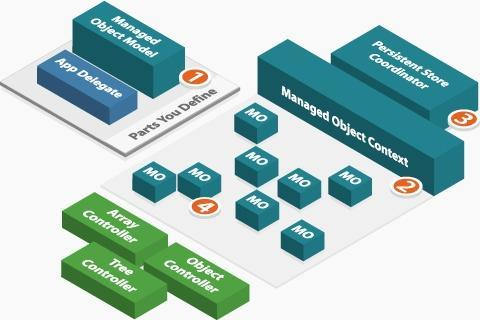

上图中是初始化`MOC`所涉及到的一些类，由这些类实例化并最终构成可以使用的`MOC`。图中编号是实例化一个具备数据处理能力的`MOC`过程，这个过程和上面介绍过的实例化上下文对象相同。

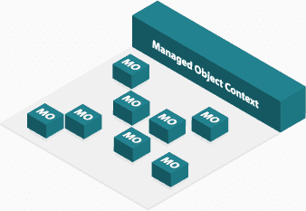

在`PSC`创建并关联本地数据库，并设置为`MOC`的`persistentStoreCoordinator`属性后，`MOC`就具备对当前存储区所有托管对象操作的能力。但是需要注意的是，`MOC`对托管对象是**懒加载**的，在使用时才会被加载到`MOC`的缓存中。

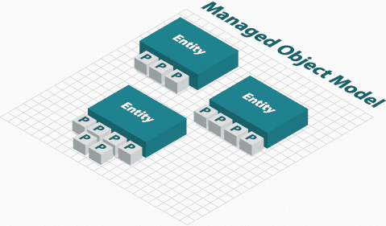

`MOM`对象加载模型文件后，获取到模型文件中所有实体的构成结构。由于`MOM`中存储着模型文件的结构，`PSC`需要通过`MOM`对象实例化本地数据库。

所有属性都存在`Entity`中，以及有关联关系的属性和请求模板，这都会在后面的章节中讲到。

可以通过`Entity`创建继承自`NSManagedObject`类的文件，这个文件就是开发中使用的托管对象，具备模型对象的表示功能，`CoreData`的本地持久化都是通过这个类及其子类完成的。

#### 持久化存储调度器

在`CoreData`的整体结构中，主要分为两部分。一个是`NSManagedObjectContext`管理的模型部分，管理着所有`CoreData`的托管对象。一个是`SQLite`实现的本地持久化部分，负责和`SQL`数据库进行数据交互，主要由`NSPersistentStore`类操作。这就构成了`CoreData`的大体结构。

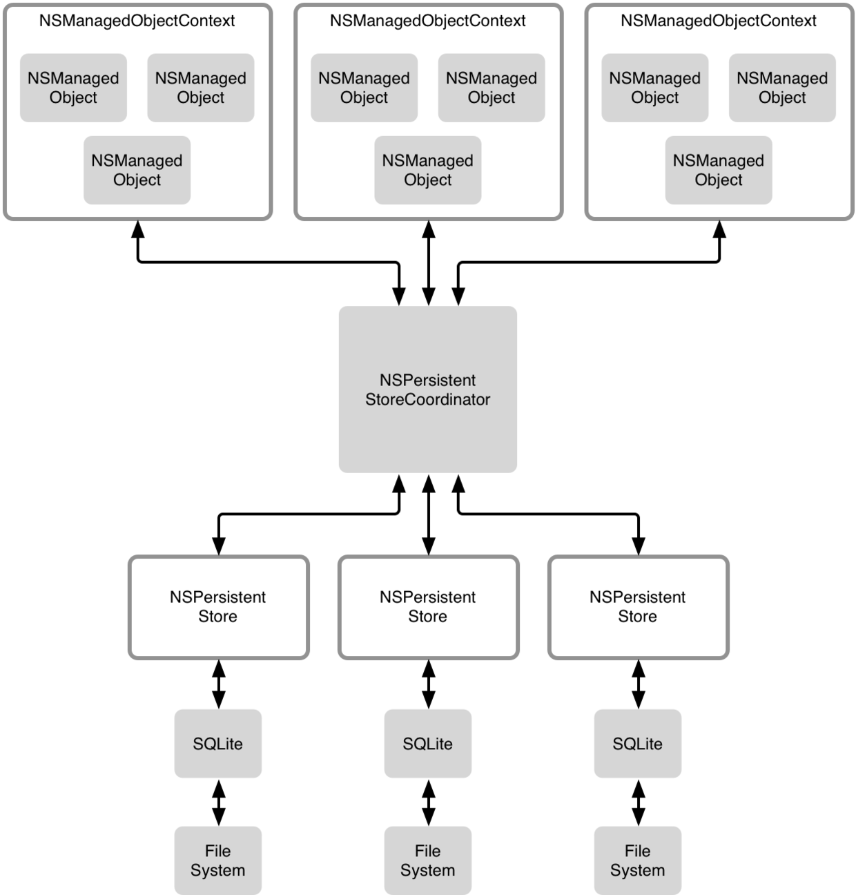

从图中可以看出，这两部分都是比较独立的，两部分的交互由一个持久化存储调度器(`NSPersistentStoreCoordinator`)来控制。上层`NSManagedObjectContext`存储的数据都是交给持久化调度器，由调度器调用具体的持久化存储对象(`NSPersistentStore`)来操作对应的数据库文件，`NSPersistentStore`负责存储的实现细节。这样就很好的将两部分实现了分离。

#### 个人随想

对于`CoreData`的整体结构，因为`CoreData`底层存储本来就是用`SQLite`实现的，所以我用`CoreData`的结构和`SQLite`对比了一下，发现还是很多相似之处的。

`.xcdatamodeld`文件代表着数据库文件结构，通过`.xcdatamodeld`编译后的`.momd`文件生成数据库。每个实体代表一张数据表，实体之间的关联关系就是`SQLite`的外键。

下图就是`CoreData`底层存储的结构，用红圈圈住的部分指向关联表的主键下标。例如`1`就指向关联表的主键下标为`1`的行。

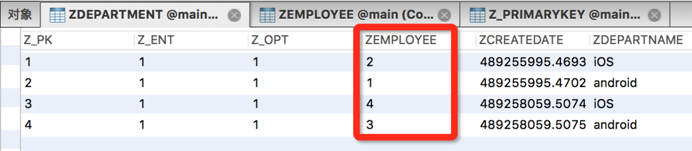

### CoreData杂谈

#### CoreData数据存储安全

`CoreData`本质还是使用`SQLite`进行存储，并没有另外提供加密功能，具体的数据加解密还需要自己完成。

**CoreData在硬盘上的数据存储结构**：

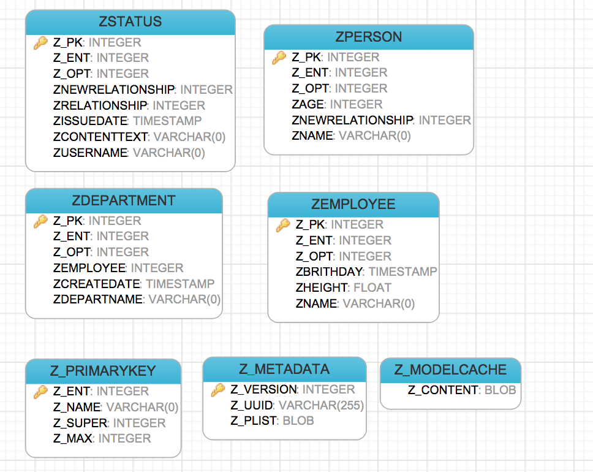

数据库存储结构

通过`PSC`指定创建`SQLite`目录后，会在指定的目录下生成一个数据库文件，同时还会生成两个同名但后缀不同的文件，其中只有后缀`.sqlite`的文件是存储数据的文件。

这个数据库文件中会默认生成三个表，`Z_METADATA`、`Z_PRIMARYKEY`、`Z_MODELCACHE`，其他我们自己的表也都是**大写Z**开头的。

在每个表中，系统还会默认生成三个字段，`Z_PK`、`Z_ENT`、`Z_OPT`三个字段，也都是**大写Z**开头并且带下划线的。其他字段就是我们自己的字段了，**大写Z**开头但不带下划线。

#### CoreData执行效率

现在市面上的大多数项目，都是使用`SQLite`作为持久化的方案，而`CoreData`的使用并不是很普遍。对于这个问题，我认为首先是很多项目开始的比较早，那时候好多`iOS`程序员都是从其他语言转过来的，更加熟悉`SQLite`，所以用`SQLite`比较多一些。后面如果不进行大的项目重构，就很难换其他的持久化方案了。

还有就是不熟悉`CoreData`，也不想去了解和深入学习`CoreData`，我认为这是很大的原因。所以项目中用`CoreData`的人并不多，而真正掌握`CoreData`技术的人更少。

之前听其他人说`CoreData`的执行效率不如`SQLite`高，这个如果深究的话，确实`CoreData`要比`SQLite`效率差一些，只不过并没有太大区别。`CoreData`本质也是在底层执行`SQL`语句，只是`CoreData`的`SQL`语句执行逻辑比较耗时，没有手动编写`SQL`语句更加直接。我们可以将`CoreData`的调试功能打开，具体看一下`SQL`语句的执行。

这里要说一点，客户端毕竟不是服务端，不需要像服务器那样大量的数据查询，所以`CoreData`是完全可以应对客户端的查询量的。如果从灵活性来说，`CoreData`确实没有`SQLite`的灵活性高，一些`SQLite`的复杂功能可能也不能实现，但是就目前大多数项目来说，`CoreData`已经能够满足项目持久化需求了。

导致执行效率差异的原因还体现在对象转换上，`CoreData`在执行`SQL`语句的基础上，还多了一层将数据映射给托管对象的操作，这样得到的就是`OC`的托管对象，而`SQLite`得到的则不是。如果给`SQLite`执行完成后，也加一层创建托管对象并赋值的操作，这时候对比性能两者的差距可能就会更小了。

#### 性能评测

下面是一篇关于`CoreData`、`FMDB`、`Realm`性能测试结果的博客，最后的结果我也没有去验证，只是大致看了一下代码还是比价靠谱的。作者[测试Demo](https://github.com/SureEdding/iOS-different-Content-Persistent-method-test)和[原文地址](http://suree.org/2015/09/29/DatabaseThink/)。

**测试数据的数量是以K为单位，最少为1K的数据量。涉及到的操作主要是下面四种**：

1. 新建数据库并插入`1K`条数据。
2. 已有数据库，插入`1K`条数据。
3. 查询总量为`10K`条数据，连续查询单次为`1K`数据。
4. `10K`条数据总量，更新其中`1K`条数据的部分字段性能。

##### 性能评测结果：

根据测试结果可以发现，在前面两种插入操作，`CoreData`的性能比`FMDB`和`Realm`要快很多。

而对于查询操作，`CoreData`比其他两种操作耗时多很多，大概多出三四倍。这很可能和`CoreData`将查询结果的数据转为托管对象有关系，抛去`CoreData`这部分转换操作性能会比现在好很多。

而更新操作则直接基于`SQLite`封装的`FMDB`有绝对的优势，`FMDB`和其他两种操作差距大概是十倍左右，而其他两种操作性能差不多。当然`CoreData`也存在着上面提到的对象转换操作，`CoreData`抛去这步结果可能会比现在好很多。

##### 测试图表

下面的测试数据中，取得是三次测试结果的平均值。

| 第三方 | 编号 |
| :-: | :-: |
| CoreData | 1 |
| FMDB | 2 |
| Realm | 3 |

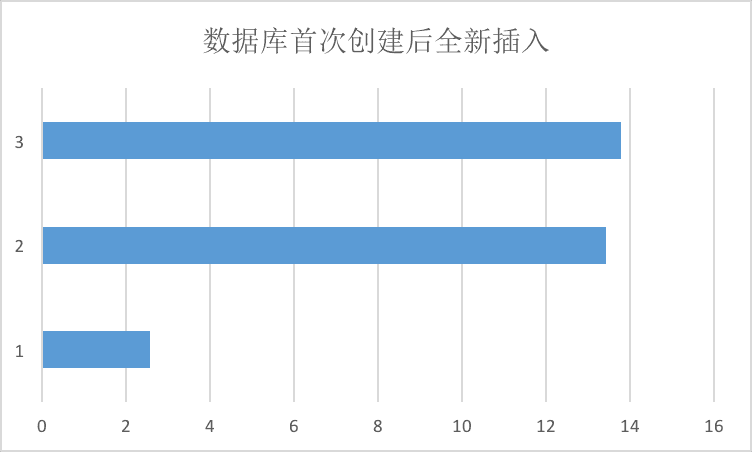
新建数据库并插入1K条数据

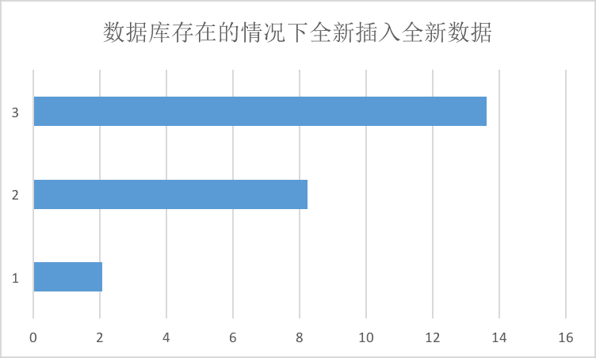
已有数据库，插入1K条数据

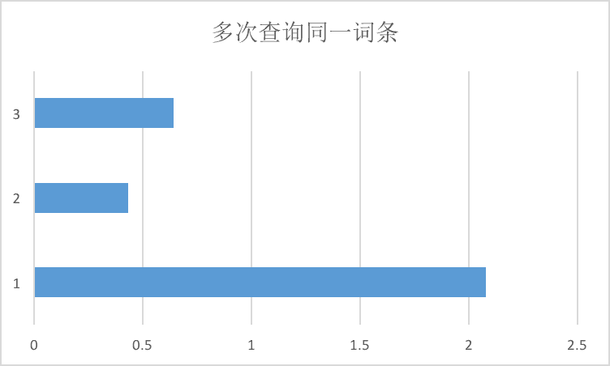

查询总量为10K条数据，连续查询单次为1K数据

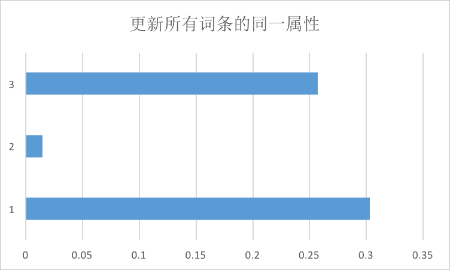

10K条数据总量，更新其中1K条数据的部分字段性能

### CoreData调试

##### Xcode调试命令

`CoreData`本质上是对`SQLite`的一个封装，在内部将对象的持久化转化为`SQL`语句执行，可以在项目中将`CoreData`调试打开，从而可以看到`CoreData`的`SQL`语句执行和一些其他`log`信息。

1. 打开`Product`，选择`Edit Scheme`.
2. 选择`Arguments`，在下面的`ArgumentsPassed On Launch`中添加下面两个选项。
    (1)`-com.apple.CoreData.SQLDebug`
    (2)`1`

##### 终端调试命令

如果是在模拟器上调试程序，可以通过 `sqlite3 /数据库路径/` 命令来查看和操作数据库。
`.tables` 查看当前数据库文件中所有的表名
`select *from tableName` 执行查询的`SQL`语句

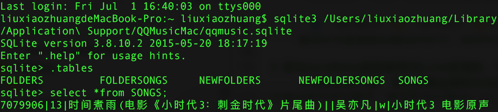

终端调试命令

* * *

好多同学都问我有`Demo`没有，其实文章中贴出的代码组合起来就是个`Demo`。后来想了想，还是给本系列文章配了一个简单的`Demo`，方便大家运行调试，后续会给所有博客的文章都加上`Demo`。

`Demo`只是来辅助读者更好的理解文章中的内容，**应该博客结合`Demo`一起学习，只看`Demo`还是不能理解更深层的原理**。`Demo`中几乎每一行代码都会有注释，各位可以打断点跟着`Demo`执行流程走一遍，看看各个阶段变量的值。

