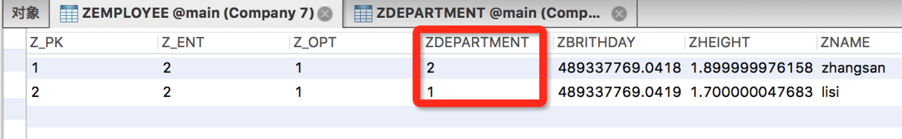
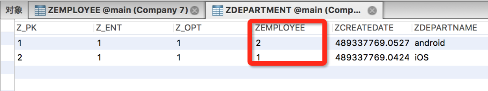
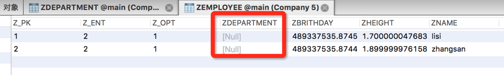
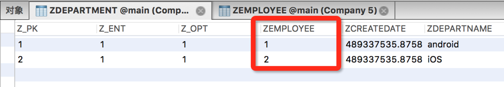
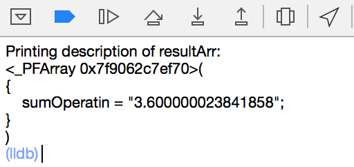

# 使用进阶

在这篇文章中，将会涉及关于`CoreData`的一些复杂操作，这些操作会涉及分页查询、模糊查询、批处理等高级操作。

通过这些操作可以更好的使用`CoreData`，提升`CoreData`性能。文章中将会出现大量示例代码，通过代码的方式更有助于理解。

### NSPredicate

##### 概述

在`iOS`开发过程中，很多需求都需要用到过滤条件。例如过滤一个集合对象中存储的对象，可以通过`Foundation`框架下的`NSPredicate`类来执行这个操作。

`CoreData`中可以通过设置`NSFetchRequest`类的`predicate`属性，来设置一个`NSPredicate`类型的谓词对象当做过滤条件。通过设置这个过滤条件，可以只获取符合过滤条件的托管对象，不会将所有托管对象都加载到内存中。这样是非常节省内存和加快查找速度的，设计一个好的`NSPredicate`可以优化`CoreData`搜索性能。

##### 语法

`NSPredicate`更加偏向于自然语言，不像`SQLite`一样有很多固定的语法，看起来也更加清晰易懂。例如下面需要查找条件为**年龄30岁以上**，并且**包括30岁**的条件。

```
[NSPredicate predicateWithFormat:@"age >= 30"]
```

##### 过滤集合对象

可以通过`NSPredicate`对`iOS`中的集合对象执行过滤操作，可以是`NSArray`、`NSSet`及其子类。

对不可变数组`NSArray`执行的过滤，过滤后会返回一个`NSArray`类型的结果数组，其中存储着符合过滤条件的对象。

```
NSArray *results = [array filteredArrayUsingPredicate:predicate]
```

对可变数组`NSMutableArray`执行的过滤条件，过滤后会直接改变原集合对象内部存储的对象，删除不符合条件的对象。

```
[arrayM filterUsingPredicate:predicate]
```

##### 复合过滤条件

谓词不只可以过滤简单条件，还可以过滤复杂条件，设置复合过滤条件。

```
[NSPredicate predicateWithFormat:@"(age < 25) AND (firstName = XiaoZhuang)"]
```

当然也可以通过`NSCompoundPredicate`对象来设置复合过滤条件，返回结果是一个`NSPredicate`的子类`NSCompoundPredicate`对象。

```
[[NSCompoundPredicate alloc] initWithType:NSAndPredicateType subpredicates:@[predicate1, predicate2]]
```

枚举值`NSCompoundPredicateType`参数，可以设置三种复合条件，枚举值非常直观很容易看懂。

* **NSNotPredicateType**
* **NSAndPredicateType**
* **NSOrPredicateType**

##### 基础语法

下面是列举的一些`NSPredicate`的基础语法，这些语法看起来非常容易理解，**更复杂的用法可以去看苹果的官方API**。

| 语法 | 作用 |
| :-: | :-: |
| == | 判断是否相等 |
| >= | 大于或等于 |
|  | 大于 |
| < | 小于 |
| != | 不等于 |
| AND 或 && | 和 |
| OR 或 II | 或 |
| NOT 或 ! | 非 |

##### 正则表达式

`NSPredicate`中还可以使用**正则表达式**，可以通过正则表达式完成一些复杂需求，这使得谓词的功能更加强大，例如下面是一个**手机号验证的正则表达式**。

```
NSString *mobile = @"^1(3[0-9]|5[0-35-9]|8[025-9])\\d{8}$";
NSPredicate *regexmobile = [NSPredicate predicateWithFormat:@"SELF MATCHES %@", mobile];
```

##### 模糊查询

`NSPredicate`支持对数据的模糊查询，例如下面使用通配符来**匹配包含lxz的结果**，具体`CoreData`中的使用在下面会讲到。

```
[NSPredicate predicateWithFormat:@"name LIKE %@", @"*lxz*"]
```

##### keyPath

`NSPredicate`在创建查询条件时，还支持设置被匹配目标的`keyPath`，也就是**设置更深层被匹配的目标**。例如下面设置`employee`的`name`属性为查找条件，就是用点语法设置的`keyPath`。

```
[NSPredicate predicateWithFormat:@"employee.name = %@", @"lxz"]
```

* * *

### 设置查询条件

在之前的文章中，执行下面`MOC`的`fetchRequest`方法，一般都需要传入一个`NSFetchRequest`类型的参数。这个`request`参数可以做一些设置操作，这样就可以以较优的性能获取指定的数据。

```
- (nullable NSArray *)executeFetchRequest:(NSFetchRequest *)request error:(NSError **)error;
```

#### NSFetchRequest

在执行`fetch`操作前，可以给`NSFetchRequest`设置一些参数，这些参数包括谓词、排序等条件，下面是一些基础的设置。

* 设置查找哪个实体，从数据库的角度来看就是查找哪张表，通过`fetchRequestWithEntityName:`或初始化方法来指定表名。
* 通过`NSPredicate`类型的属性，可以设置查找条件，这个属性在开发中用得最多。`NSPredicate`可以包括固定格式的条件以及**正则表达式**。
* 通过`sortDescriptors`属性，可以设置获取结果数组的排序方式，这个属性是一个数组类型，也就是**可以设置多种排序条件**。(但是注意条件不要冲突)
* 通过`fetchOffset`属性设置从查询结果的第几个开始获取，通过`fetchLimit`属性设置每次获取多少个。主要用于**分页查询**，后面会讲。

`MOC`执行`fetch`操作后，获取的结果是以数组的形式存储的，数组中存储的就是托管对象。`NSFetchRequest`提供了参数`resultType`，参数类型是一个枚举类型。通过这个参数，可以设置执行`fetch`操作后返回的数据类型。

* **NSManagedObjectResultType**: 返回值是`NSManagedObject`的子类，也就是托管对象，这是默认选项
* **NSManagedObjectIDResultType**: 返回`NSManagedObjectID`类型的对象，也就是`NSManagedObject`的`ID`，对内存占用比较小。`MOC`可以通过`NSManagedObjectID`对象获取对应的托管对象，并且可以通过缓存`NSManagedObjectID`参数来节省内存消耗
* **NSDictionaryResultType**: 返回字典类型对象
* **NSCountResultType**: 返回请求结果的`count`值，这个操作是发生在数据库层级的，并不需要将数据加载到内存中

#### 设置获取条件

```
// 建立获取数据的请求对象，并指明操作Employee表
NSFetchRequest *request = [NSFetchRequest fetchRequestWithEntityName:@"Employee"];

// 设置请求条件，通过设置的条件，来过滤出需要的数据
NSPredicate *predicate = [NSPredicate predicateWithFormat:@"name = %@", @"lxz"];
request.predicate = predicate;

// 设置请求结果排序方式，可以设置一个或一组排序方式，最后将所有的排序方式添加到排序数组中
NSSortDescriptor *sort = [NSSortDescriptor sortDescriptorWithKey:@"height" ascending:YES];
// NSSortDescriptor的操作都是在SQLite层级完成的，不会将对象加载到内存中，所以对内存的消耗是非常小的
request.sortDescriptors = @[sort];

// 执行获取请求操作，获取的托管对象将会被存储在一个数组中并返回
NSError *error = nil;
NSArray<Employee *> *employees = [context executeFetchRequest:request error:&error];
[employees enumerateObjectsUsingBlock:^(Employee * _Nonnull obj, NSUInteger idx, BOOL * _Nonnull stop) {
    NSLog(@"Employee Name : %@, Height : %@, Brithday : %@", obj.name, obj.height, obj.brithday);
}];

// 错误处理
if (error) {
    NSLog(@"CoreData Fetch Data Error : %@", error);
}
```

这里设置`NSFetchRequest`对象的一些请求条件，设置查找`Employee`表中`name`为`lxz`的数据，并且将所有符合的数据用`height`值**升序**的方式排列。

### 有实体关联关系

一个模型文件中的不同实体间，可以设置实体间的关联关系，这个在之前的文章中讲过。实体关联关系分为**对一**或**对多**，也可以设置是否**双向关联**。

这里演示的实体只是简单的`To One`的关系，并且下面会给出设置是否双向关联的区别对比。

#### 插入实体

```
// 创建托管对象，并将其关联到指定的MOC上
Employee *zsEmployee = [NSEntityDescription insertNewObjectForEntityForName:@"Employee" inManagedObjectContext:context];
zsEmployee.name = @"zhangsan";
zsEmployee.height = @1.9f;
zsEmployee.brithday = [NSDate date];

Employee *lsEmployee = [NSEntityDescription insertNewObjectForEntityForName:@"Employee" inManagedObjectContext:context];
lsEmployee.name = @"lisi";
lsEmployee.height = @1.7f;
lsEmployee.brithday = [NSDate date];

Department *iosDepartment = [NSEntityDescription insertNewObjectForEntityForName:@"Department" inManagedObjectContext:context];
iosDepartment.departName = @"iOS";
iosDepartment.createDate = [NSDate date];
iosDepartment.employee = zsEmployee;

Department *androidDepartment = [NSEntityDescription insertNewObjectForEntityForName:@"Department" inManagedObjectContext:context];
androidDepartment.departName = @"android";
androidDepartment.createDate = [NSDate date];
androidDepartment.employee = lsEmployee;

// 执行存储操作
NSError *error = nil;
if (context.hasChanges) {
    [context save:&error];
}

// 错误处理
if (error) {
    NSLog(@"Association Table Add Data Error : %@", error);
}
```

上面创建了四个实体，并且将`Employee`都关联到`Department`上，完成关联操作后通过`MOC`存储到本地。

可以看到上面所有的托管对象创建时，都使用`NSEntityDescription`的`insert`方法创建，**并和上下文建立关系**。这时就想问了，我能直接采用传统的`init`方法创建吗？

**会崩的**😱！**创建托管对象时需要指定MOC**，在运行时动态的生成`set`、`get`方法。但是直接通过`init`方法初始化的对象，系统是不知道这里是需要系统自身生成`set`、`get`方法的，而且系统也不知道应该对应哪个`MOC`，会导致方法未实现的崩溃。所以就出现了开发中经常出现的错误，如下面崩溃信息：

```
-[Employee setName:]: unrecognized selector sent to instance 0x7fa665900f60
```

#### 双向关联

在上一篇文章中提到过**双向关联**的概念，也就是设置`Relationship`时`Inverse`是否为空。下面是`Employee`和`Department`在数据库中，设置`inverse`和没有设置`inverse`的两种数据存储，可以很清晰的对比出设置双向关联的区别。
测试代码还是用上面插入实体的代码，只是更改`inverse`选项。

设置双向关联



Employee



Department

未设置双向关联



Employee



Department

从图中可以看出，未设置双向关联的实体，`Department`关联`Employee`为属性并存储后，`Department`表中的关系是存在的，但`Employee`表中的关系依然是空的。而设置双向关联后的实体，在`Department`关联`Employee`为属性并存储后，`Employee`在表中自动设置了和`Department`的关系。

双向关联的关系不只体现在数据库中，在程序运行过程中托管对象的关联属性，也是随着发生变化的。双向关联的双方，一方的关联属性设置关系后，另一方关联属性的关系也会发生变化。用下面的代码打印一下各自的关联属性，结果和上面数据库的变化是一样的。

```
NSLog(@"Department : %@, Employee : %@", androidDepartment.employee, lsEmployee.department);
```

#### 查询操作

```
// 创建获取数据的请求对象，并指明操作Department表
NSFetchRequest *request = [NSFetchRequest fetchRequestWithEntityName:@"Department"];

// 设置请求条件，设置employee的name为请求条件。NSPredicate的好处在于，可以设置keyPath条件
NSPredicate *predicate = [NSPredicate predicateWithFormat:@"employee.name = %@", @"lxz"];
request.predicate = predicate;

// 执行查找操作
NSError *error = nil;
NSArray<Department *> *departments = [context executeFetchRequest:request error:&error];
[departments enumerateObjectsUsingBlock:^(Department * _Nonnull obj, NSUInteger idx, BOOL * _Nonnull stop) {
    NSLog(@"Department Search Result DepartName : %@, employee name : %@", obj.departName, obj.employee.name);
}];

// 错误处理
if (error) {
    NSLog(@"Department Search Error : %@", error);
}
```

查找`Department`实体，并打印实体内容。就像上面讲的双向关系一样，有关联关系的实体，自己被查找出来后，也会**将与之关联的其他实体也查找出来**，并且查找出来的实体都是关联着`MOC`的。

### 分页查询

在从本地存储区获取数据时，可以**指定从第几个获取**，以及**本次查询获取多少个数据**，联合起来使用就是**分页查询**。当然也可以根据需求，单独使用这两个`API`。

这种需求在实际开发中非常常见，例如`TableView`中，上拉加载数据，每次加载**20条**数据，就可以利用分页查询轻松实现。

```
// 创建获取数据的请求对象，并指明操作Employee表
NSFetchRequest *request = [NSFetchRequest fetchRequestWithEntityName:@"Employee"];

// 设置查找起始点，这里是从搜索结果的第六个开始获取
request.fetchOffset = 6;

// 设置分页，每次请求获取六个托管对象
request.fetchLimit = 6;

// 设置排序规则，这里设置身高升序排序
NSSortDescriptor *descriptor = [NSSortDescriptor sortDescriptorWithKey:@"height" ascending:YES];
request.sortDescriptors = @[descriptor];

// 执行查询操作
NSError *error = nil;
NSArray<Employee *> *employees = [context executeFetchRequest:request error:&error];
[employees enumerateObjectsUsingBlock:^(Employee * _Nonnull obj, NSUInteger idx, BOOL * _Nonnull stop) {
    NSLog(@"Page Search Result Name : %@, height : %@", obj.name, obj.height);
}];

// 错误处理
if (error) {
    NSLog(@"Page Search Data Error : %@", error);
}
```

上面是一个按照身高升序排序，**分页获取**搜索结果的例子。查找`Employee`表中的实体，将结果按照`height`字段升序排序，并从结果的第六个开始查找，并且设置获取的数量也是六个。

### 模糊查询

有时需要**获取具有某些相同特征**的数据，这样就需要对查询的结果做**模糊匹配**。在`CoreData`执行模糊匹配时，可以通过`NSPredicate`执行这个操作。

```
// 创建获取数据的请求对象，设置对Employee表进行操作
NSFetchRequest *request = [NSFetchRequest fetchRequestWithEntityName:@"Employee"];

// 创建模糊查询条件。这里设置的带通配符的查询，查询条件是结果包含lxz
NSPredicate *predicate = [NSPredicate predicateWithFormat:@"name LIKE %@", @"*lxz*"];
request.predicate = predicate;

// 执行查询操作
NSError *error = nil;
NSArray<Employee *> *employees = [context executeFetchRequest:request error:&error];
[employees enumerateObjectsUsingBlock:^(Employee * _Nonnull obj, NSUInteger idx, BOOL * _Nonnull stop) {
    NSLog(@"Fuzzy Search Result Name : %@, height : %@", obj.name, obj.height);
}];

// 错误处理
if (error) {
    NSLog(@"Fuzzy Search Data Error : %@", error);
}
```

上面是使用**通配符**的方式进行**模糊查询**，`NSPredicate`支持多种形式的模糊查询，下面列举一些简单的匹配方式。模糊查询条件**对大小写不敏感**，所以查询条件大小写均可。

* 以lxz开头

    ```
    NSPredicate *predicate = [NSPredicate predicateWithFormat:@"name BEGINSWITH %@", @"lxz"];
    ```

* 以lxz结尾

    ```
    NSPredicate *predicate = [NSPredicate predicateWithFormat:@"name ENDSWITH %@", @"lxz"];
    ```

* 其中包含lxz

    ```
    NSPredicate *predicate = [NSPredicate predicateWithFormat:@"name contains %@", @"lxz"];
    ```

* 查询条件结果包含lxz

    ```
    NSPredicate *predicate = [NSPredicate predicateWithFormat:@"name LIKE %@", @"*lxz*"];
    ```

### 加载请求模板

在之前的文章中谈到**在模型文件中设置请求模板**，也就是在`.xcdatamodeld`文件中，设置`Fetch Requests`，使用时可以通过对应的`NSManagedObjectModel`获取设置好的模板。

```
.... 省略上下文创建步骤 ....
// 通过MOC获取模型文件对应的托管对象模型
NSManagedObjectModel *model = context.persistentStoreCoordinator.managedObjectModel;
// 通过.xcdatamodeld文件中设置的模板名，获取请求对象
NSFetchRequest *fetchRequest = [model fetchRequestTemplateForName:@"EmployeeFR"];

// 请求数据，下面的操作和普通请求一样
NSError *error = nil;
NSArray<Employee *> *dataList = [context executeFetchRequest:fetchRequest error:&error];
[dataList enumerateObjectsUsingBlock:^(Employee * _Nonnull obj, NSUInteger idx, BOOL * _Nonnull stop) {
    NSLog(@"Employee.count = %ld, Employee.height = %f", dataList.count, [obj.height floatValue]);
}];

// 错误处理
if (error) {
    NSLog(@"Execute Fetch Request Error : %@", error);
}
```

### 获取结果Count值

开发过程中有时需要只获取所需数据的`Count`值，也就是执行获取操作后**数组中所存储的对象数量**。遇到这个需求，如果像之前一样`MOC`执行获取操作，获取到数组然后取`Count`，这样**对内存消耗是很大的**。

对于这个需求，苹果提供了两种常用的方式获取这个`Count`值。这两种获取操作，都是在数据库中完成的，**并不需要将托管对象加载到内存中**，对内存的开销也是很小的。

#### 方法1，设置resultType

```
// 设置过滤条件，可以根据需求设置自己的过滤条件
NSPredicate *predicate = [NSPredicate predicateWithFormat:@"height < 2"];
// 创建请求对象，并指明操作Employee表
NSFetchRequest *fetchRequest = [NSFetchRequest fetchRequestWithEntityName:@"Employee"];
fetchRequest.predicate = predicate;
// 这一步是关键。设置返回结果类型为Count，返回结果为NSNumber类型
fetchRequest.resultType = NSCountResultType;

// 执行查询操作，返回的结果还是数组，数组中只存在一个对象，就是计算出的Count值
NSError *error = nil;
NSArray *dataList = [context executeFetchRequest:fetchRequest error:&error];
NSInteger count = [dataList.firstObject integerValue];
NSLog(@"fetch request result Employee.count = %ld", count);

// 错误处理
if (error) {
    NSLog(@"fetch request result error : %@", error);
}
```

**方法1**中设置`NSFetchRequest`对象的`resultType`为`NSCountResultType`，获取到结果的`Count`值。这个枚举值在之前的文章中提到过，除了`Count`参数，还可以设置其他三种参数。

#### 方法2，使用MOC提供的方法

```
// 设置过滤条件
NSPredicate *predicate = [NSPredicate predicateWithFormat:@"height < 2"];
// 创建请求对象，指明操作Employee表
NSFetchRequest *fetchRequest = [NSFetchRequest fetchRequestWithEntityName:@"Employee"];
fetchRequest.predicate = predicate;

// 通过调用MOC的countForFetchRequest:error:方法，获取请求结果count值，返回结果直接是NSUInteger类型变量
NSError *error = nil;
NSUInteger count = [context countForFetchRequest:fetchRequest error:&error];
NSLog(@"fetch request result count is : %ld", count);

// 错误处理
if (error) {
    NSLog(@"fetch request result error : %@", error);
}
```

`MOC`提供了专门获取请求结果`Count`值的方法，通过这个方法可以直接返回一个`NSUInteger`类型的`Count`值，使用起来比上面的方法更方便点，其他都是一样的。

### 位运算

假设有需求是对`Employee`表中，所有托管对象的`height`属性**计算总和**。这个需求在数据量比较大的情况下，将所有托管对象加载到内存中是非常消耗内存的，就算批量加载也比较耗时耗内存。

`CoreData`对于这样的需求，提供了**位运算**的功能。`MOC`在执行请求时，是支持对数据进行位运算的。这个操作依然是**在数据库层完成**的，对内存的占用非常小。

```
// 创建请求对象，指明操作Employee表
NSFetchRequest *fetchRequest = [NSFetchRequest fetchRequestWithEntityName:@"Employee"];
// 设置返回值为字典类型，这是为了结果可以通过设置的name名取出，这一步是必须的
fetchRequest.resultType = NSDictionaryResultType;

// 创建描述对象
NSExpressionDescription *expressionDes = [[NSExpressionDescription alloc] init];
// 设置描述对象的name，最后结果需要用这个name当做key来取出结果
expressionDes.name = @"sumOperatin";
// 设置返回值类型，根据运算结果设置类型
expressionDes.expressionResultType = NSFloatAttributeType;

// 创建具体描述对象，用来描述对那个属性进行什么运算(可执行的运算类型很多，这里描述的是对height属性，做sum运算)
NSExpression *expression = [NSExpression expressionForFunction:@"sum:" arguments:@[[NSExpression expressionForKeyPath:@"height"]]];
// 只能对应一个具体描述对象
expressionDes.expression = expression;
// 给请求对象设置描述对象，这里是一个数组类型，也就是可以设置多个描述对象
fetchRequest.propertiesToFetch = @[expressionDes];

// 执行请求，返回值还是一个数组，数组中只有一个元素，就是存储计算结果的字典
NSError *error = nil;
NSArray *resultArr = [context executeFetchRequest:fetchRequest error:&error];
// 通过上面设置的name值，当做请求结果的key取出计算结果
NSNumber *number = resultArr.firstObject[@"sumOperatin"];
NSLog(@"fetch request result is %f", [number floatValue]);

// 错误处理
if (error) {
    NSLog(@"fetch request result error : %@", error);
}
```

###### 执行结果
 



从执行结果可以看到，`MOC`对所有查找到的托管对象`height`属性执行了求和操作，并**将结果放在字典中**返回。位运算主要是通过`NSFetchRequest`对象的`propertiesToFetch`属性设置，这个属性可以设置多个描述对象，最后通过不同的`name`当做`key`来取出结果即可。

`NSExpression`类可以描述多种运算，可以在`NSExpression.h`文件中的注释部分，看到所有支持的运算类型，大概看了一下有二十多种运算。而且除了上面`NSExpression`调用的方法，此类还支持**点语法**的位运算，例如下面的例子。

```
[NSExpression expressionWithFormat:@"@sum.height"];
```

### 批处理

在使用`CoreData`之前，我和公司同事也讨论过，假设遇到需要**大量数据处理**的时候怎么办。`CoreData`对于大量数据处理的灵活性肯定不如`SQLite`，这时候还需要自己使用其他方式优化数据处理。**虽然在移动端这种情况很少出现**，但是在持久层设计时还是要考虑这方面。

当需要进行数据的处理时，`CoreData`需要先将数据**加载到内存中**，然后才能对数据进行处理。这样对于大量数据来说，都加载到内存中是非常消耗内存的，而且容易导致崩溃的发生。如果遇到**更改所有数据的某个字段**这样的简单需求，需要将相关的托管对象都加载到内存中，然后进行更改、保存。

对于上面这样的问题，`CoreData`在`iOS8`推出了**批量更新API**，通过这个`API`可以直接在**数据库一层**就完成更新操作，而**不需要将数据加载到内存**。除了批量更新操作，在`iOS9`中还推出了**批量删除API**，也是在数据库一层完成的操作。关于批处理的`API`很多都是`iOS8`、`iOS9`出来的，使用时**需要注意版本兼容**。

但是有个问题，批量更新和批量删除的两个`API`，都是**直接对数据库进行操作**，更新完之后会导致`MOC`缓存和本地持久化**数据不同步**的问题。所以**需要手动刷新受影响的MOC中存储的托管对象**，使`MOC`和本地统一。假设你使用了`NSFetchedResultsController`，为了保证界面和数据的统一，这一步更新操作更需要做。

#### 批量更新

```
// 创建批量更新对象，并指明操作Employee表。
NSBatchUpdateRequest *updateRequest = [NSBatchUpdateRequest batchUpdateRequestWithEntityName:@"Employee"];
// 设置返回值类型，默认是什么都不返回(NSStatusOnlyResultType)，这里设置返回发生改变的对象Count值
updateRequest.resultType = NSUpdatedObjectsCountResultType;
// 设置发生改变字段的字典
updateRequest.propertiesToUpdate = @{@"height" : [NSNumber numberWithFloat:5.f]};

// 执行请求后，返回值是一个特定的result对象，通过result的属性获取返回的结果。MOC的这个API是从iOS8出来的，所以需要注意版本兼容。
NSError *error = nil;
NSBatchUpdateResult *result = [context executeRequest:updateRequest error:&error];
NSLog(@"batch update count is %ld", [result.result integerValue]);

// 错误处理
if (error) {
    NSLog(@"batch update request result error : %@", error);
}

// 更新MOC中的托管对象，使MOC和本地持久化区数据同步
[context refreshAllObjects];
```

上面对`Employee`表中所有的托管对象`height`值做了批量更新，在更新时通过设置`propertiesToUpdate`字典来控制更新字段和更新的值，设置格式是`字段名 : 新值`。通过设置批处理对象的`predicate`属性，设置一个谓词对象来**控制受影响的对象**。

还可以对多个存储区(数据库)做同样批处理操作，通过设置**其父类**的`affectedStores`属性，类型是一个数组，可以包含受影响的存储区，多个存储区的操作**对批量删除同样适用**。

`MOC`在执行请求方法时，发现方法名也不一样了，执行的是`executeRequest: error:`方法，这个方法是从`iOS8`之后出来的。方法传入的参数是`NSBatchUpdateRequest`类，此类并不是继承自`NSFetchRequest`类，而是直接继承自`NSPersistentStoreRequest`，和`NSFetchRequest`是平级关系。

#### 批量删除

```
// 创建请求对象，并指明对Employee表做操作
NSFetchRequest *fetchRequest = [NSFetchRequest fetchRequestWithEntityName:@"Employee"];
// 通过谓词设置过滤条件，设置条件为height小于1.7
NSPredicate *predicate = [NSPredicate predicateWithFormat:@"height < %f", 1.7f];
fetchRequest.predicate = predicate;

// 创建批量删除请求，并使用上面创建的请求对象当做参数进行初始化
NSBatchDeleteRequest *deleteRequest = [[NSBatchDeleteRequest alloc] initWithFetchRequest:fetchRequest];
// 设置请求结果类型，设置为受影响对象的Count
deleteRequest.resultType = NSBatchDeleteResultTypeCount;

// 使用NSBatchDeleteResult对象来接受返回结果，通过id类型的属性result获取结果
NSError *error = nil;
NSBatchDeleteResult *result = [context executeRequest:deleteRequest error:&error];
NSLog(@"batch delete request result count is %ld", [result.result integerValue]);

// 错误处理
if (error) {
    NSLog(@"batch delete request error : %@", error);
}

// 更新MOC中的托管对象，使MOC和本地持久化区数据同步
[context refreshAllObjects];
```

大多数情况下，涉及到托管对象的操作，都需要将其加载到内存中完成。所以使用`CoreData`时，需要注意内存的使用，**不要在内存中存在过多的托管对象**。在已经做系统兼容的情况下，进行大量数据的操作时，应该**尽量使用批处理**来完成操作。

需要注意的是，`refreshAllObjects`是从`iOS9`出来的，在`iOS9`之前因为要做版本兼容，所以需要使用`refreshObject: mergeChanges:`方法更新托管对象。

### 异步请求

```
// 创建请求对象，并指明操作Employee表
NSFetchRequest *fetchRequest = [NSFetchRequest fetchRequestWithEntityName:@"Employee"];

// 创建异步请求对象，并通过一个block进行回调，返回结果是一个NSAsynchronousFetchResult类型参数
NSAsynchronousFetchRequest *asycFetchRequest = [[NSAsynchronousFetchRequest alloc] initWithFetchRequest:fetchRequest completionBlock:^(NSAsynchronousFetchResult * _Nonnull result) {

    [result.finalResult enumerateObjectsUsingBlock:^(Employee * _Nonnull obj, NSUInteger idx, BOOL * _Nonnull stop) {
        NSLog(@"fetch request result Employee.count = %ld, Employee.name = %@", result.finalResult.count, obj.name);
    }];
}];

// 执行异步请求，和批量处理执行同一个请求方法
NSError *error = nil;
[context executeRequest:asycFetchRequest error:&error];

// 错误处理
if (error) {
    NSLog(@"fetch request result error : %@", error);
}
```

上面通过`NSAsynchronousFetchRequest`对象创建了一个异步请求，并通过`block`进行回调。如果**有多个请求同时发起**，**不需要担心线程安全的问题**，系统会将所有的异步请求**添加到一个操作队列中**，在前一个任务访问数据库时，`CoreData`会将数据库加锁，等前面的执行完成才会继续执行后面的操作。

`NSAsynchronousFetchRequest`提供了`cancel`方法，也就是可以在请求过程中，将这个请求取消。还可以通过一个`NSProgress`类型的属性，获取请求完成进度。`NSAsynchronousFetchRequest`类从`iOS8`开始可以使用，所以低版本需要做版本兼容。

需要注意的是，执行请求时`MOC`并发类型不能是`NSConfinementConcurrencyType`，这个并发类型已经被抛弃，会导致崩溃。

* * *

好多同学都问我有`Demo`没有，其实文章中贴出的代码组合起来就是个`Demo`。后来想了想，还是给本系列文章配了一个简单的`Demo`，方便大家运行调试，后续会给所有博客的文章都加上`Demo`。

`Demo`只是来辅助读者更好的理解文章中的内容，**应该博客结合`Demo`一起学习，只看`Demo`还是不能理解更深层的原理**。`Demo`中几乎每一行代码都会有注释，各位可以打断点跟着`Demo`执行流程走一遍，看看各个阶段变量的值。

