# 高级用法

在之前的文章中，已经讲了很多关于`CoreData`使用相关的知识点。这篇文章中主要讲两个方面，`NSFetchedResultsController`和版本迁移。

**NSFetchedResultsController**

### NSFetchedResultsController

在开发过程中会经常用到`UITableView`这样的视图类，这些视图类**需要自己管理其数据源**，包括网络获取、本地存储都需要写代码进行管理。

而在`CoreData`中提供了`NSFetchedResultsController`类(`fetched results controller`，也叫`FRC`)，`FRC`可以管理`UITableView`或`UICollectionView`的数据源。这个数据源主要**指本地持久化的数据**，也可以用这个数据源配合着网络请求数据一起使用，主要看业务需求了。

本篇文章会使用`UITableView`作为视图类，配合`NSFetchedResultsController`进行后面的演示，`UICollectionView`配合`NSFetchedResultsController`的使用也是类似，这里就不都讲了。

#### 简单介绍

就像上面说到的，`NSFetchedResultsController`就像是上面两种**视图的数据管理者**一样。`FRC`可以监听一个`MOC`的改变，如果`MOC`执行了托管对象的增删改操作，就会对本地持久化数据发生改变，`FRC`就会回调对应的代理方法，回调方法的参数会包括执行操作的类型、操作的值、`indexPath`等参数。

实际使用时，通过`FRC`**“绑定”**一个`MOC`，将`UITableView`嵌入在`FRC`的执行流程中。在任何地方对这个**“绑定”**的`MOC`存储区做修改，都会触发`FRC`的回调方法，在`FRC`的回调方法中嵌入`UITableView`代码并做对应修改即可。

由此可以看出`FRC`最大优势就是，**始终和本地持久化的数据保持统一**。只要本地持久化的数据发生改变，就会触发`FRC`的回调方法，从而在回调方法中更新上层数据源和`UI`。这种方式讲的简单一点，就可以叫做**数据带动UI**。

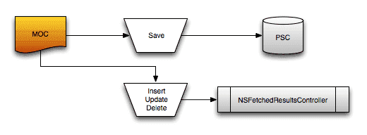

FRC

但是需要注意一点，在`FRC`的初始化中传入了一个`MOC`参数，`FRC`只能监测传入的`MOC`发生的改变。假设其他`MOC`对同一个存储区发生了改变，`FRC`则不能监测到这个变化，不会做出任何反应。

所以使用`FRC`时，需要注意`FRC`只能对一个`MOC`的变化做出反应，所以在`CoreData`持久化层设计时，尽量一个存储区只对应一个`MOC`，或设置一个负责`UI`的`MOC`，这在后面多线程部分会详细讲解。

#### 修改模型文件结构

在写代码之前，先对之前的模型文件结构做一些修改。

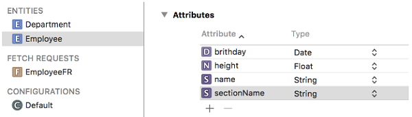

Employee结构

讲`FRC`的时候，只需要用到`Employee`这一张表，其他表和设置直接忽略。需要在`Employee`原有字段的基础上，增加一个`String`类型的`sectionName`字段，这个字段就是用来存储`section title`的，在下面的文章中将会详细讲到。

#### 初始化FRC

下面例子是比较常用的`FRC`初始化方式，初始化时指定的`MOC`，还用之前讲过的`MOC`初始化代码，`UITableView`初始化代码这里也省略了，主要突出`FRC`的初始化。

```
// 创建请求对象，并指明操作Employee表
NSFetchRequest *request = [NSFetchRequest fetchRequestWithEntityName:@"Employee"];
// 设置排序规则，指明根据height字段升序排序
NSSortDescriptor *heightSort = [NSSortDescriptor sortDescriptorWithKey:@"height" ascending:YES];
request.sortDescriptors = @[heightSort];

// 创建NSFetchedResultsController控制器实例，并绑定MOC
NSError *error = nil;
fetchedResultController = [[NSFetchedResultsController alloc] initWithFetchRequest:request 
                                                              managedObjectContext:context 
                                                                sectionNameKeyPath:@"sectionName" 
                                                                         cacheName:nil];
// 设置代理，并遵守协议
fetchedResultController.delegate = self;
// 执行获取请求，执行后FRC会从持久化存储区加载数据，其他地方可以通过FRC获取数据
[fetchedResultController performFetch:&error];

// 错误处理
if (error) {
    NSLog(@"NSFetchedResultsController init error : %@", error);
}

// 刷新UI
[tableView reloadData];
```

在上面初始化`FRC`时，传入的`sectionNameKeyPath:`参数，是指明当前托管对象的哪个属性当做`section`的`title`，在本文中就是`Employee`表的`sectionName`字段为`section`的`title`。从`NSFetchedResultsSectionInfo`协议的`indexTitle`属性获取这个值。
在`sectionNameKeyPath:`设置属性名后，就以这个属性名作为分组`title`，相同的`title`会被分到一个`section`中。

初始化`FRC`时参数`managedObjectContext:`传入了一个`MOC`参数，`FRC`只能监测这个传入的`MOC`发生的本地持久化改变。就像上面介绍时说的，其他`MOC`对同一个持久化存储区发生的改变，`FRC`则不能监测到这个变化。

再往后面看到`cacheName:`参数，这个参数我设置的是`nil`。参数的作用是开启`FRC`的缓存，对获取的数据进行缓存并指定一个名字。可以通过调用`deleteCacheWithName:`方法手动删除缓存。
但是这个缓存并没有必要，缓存是根据`NSFetchRequest`对象来匹配的，如果当前获取的数据和之前缓存的相匹配则直接拿来用，但是在获取数据时每次获取的数据都可能不同，**缓存不能被命中**则很难派上用场，而且缓存还**占用着内存资源**。

在`FRC`初始化完成后，调用`performFetch:`方法来同步获取持久化存储区数据，调用此方法后`FRC`保存数据的属性才会有值。获取到数据后，调用`tableView`的`reloadData`方法，会回调`tableView`的代理方法，可以在`tableView`的代理方法中获取到`FRC`的数据。调用`performFetch:`方法第一次获取到数据并不会回调`FRC`代理方法。

#### 代理方法

`FRC`中包含`UITableView`执行过程中需要的相关数据，可以通过`FRC`的`sections`属性，获取一个遵守`<NSFetchedResultsSectionInfo>`协议的对象数组，数组中的对象就代表一个`section`。

在这个协议中有如下定义，可以看出这些属性和`UITableView`的执行流程是紧密相关的。

```
@protocol NSFetchedResultsSectionInfo

/* Name of the section */
@property (nonatomic, readonly) NSString *name;

/* Title of the section (used when displaying the index) */
@property (nullable, nonatomic, readonly) NSString *indexTitle;

/* Number of objects in section */
@property (nonatomic, readonly) NSUInteger numberOfObjects;

/* Returns the array of objects in the section. */
@property (nullable, nonatomic, readonly) NSArray *objects;

@end // NSFetchedResultsSectionInfo
```

在使用过程中应该将`FRC`和`UITableView`相互嵌套，在`FRC`的回调方法中嵌套`UITableView`的视图改变逻辑，在`UITableView`的回调中嵌套数据更新的逻辑。这样可以**始终保证数据和UI的同步**，在下面的示例代码中将会演示`FRC`和`UITableView`的相互嵌套。

##### Table View Delegate

```
// 通过FRC的sections数组属性，获取所有section的count值
- (NSInteger)numberOfSectionsInTableView:(UITableView *)tableView {
    return fetchedResultController.sections.count;
}

// 通过当前section的下标从sections数组中取出对应的section对象，并从section对象中获取所有对象count
- (NSInteger)tableView:(UITableView *)tableView numberOfRowsInSection:(NSInteger)section {
    return fetchedResultController.sections[section].numberOfObjects;
}

// FRC根据indexPath获取托管对象，并给cell赋值
- (UITableViewCell *)tableView:(UITableView *)tableView cellForRowAtIndexPath:(NSIndexPath *)indexPath {
    Employee *emp = [fetchedResultController objectAtIndexPath:indexPath];
    UITableViewCell *cell = [tableView dequeueReusableCellWithIdentifier:@"identifier" forIndexPath:indexPath];
    cell.textLabel.text = emp.name;
    return cell;
}

// 创建FRC对象时，通过sectionNameKeyPath:传递进去的section title的属性名，在这里获取对应的属性值
- (NSString *)tableView:(UITableView *)tableView titleForHeaderInSection:(NSInteger)section {
    return fetchedResultController.sections[section].indexTitle;
}

// 是否可以编辑
- (BOOL)tableView:(UITableView *)tableView canEditRowAtIndexPath:(NSIndexPath *)indexPath {
    return YES;
}

// 这里是简单模拟UI删除cell后，本地持久化区数据和UI同步的操作。在调用下面MOC保存上下文方法后，FRC会回调代理方法并更新UI
- (void)tableView:(UITableView *)tableView commitEditingStyle:(UITableViewCellEditingStyle)editingStyle forRowAtIndexPath:(NSIndexPath *)indexPath {
     if (editingStyle == UITableViewCellEditingStyleDelete) {
        // 删除托管对象
        Employee *emp = [fetchedResultController objectAtIndexPath:indexPath];
        [context deleteObject:emp];
        // 保存上下文环境，并做错误处理
        NSError *error = nil;
        if (![context save:&error]) {
            NSLog(@"tableView delete cell error : %@", error);
        }
    }
}
```

上面是`UITableView`的代理方法，代理方法中嵌套了`FRC`的数据获取代码，这样在刷新视图时就可以保证使用最新的数据。并且在代码中简单实现了删除`cell`后，通过`MOC`调用删除操作，使本地持久化数据和`UI`保持一致。

就像上面`cellForRowAtIndexPath:`方法中使用的一样，`FRC`提供了两个方法轻松转换`indexPath`和`NSManagedObject`的对象，在实际开发中这两个方法非常实用，这也是`FRC`和`UITableView`、`UICollectionView`深度融合的表现。

```
- (id)objectAtIndexPath:(NSIndexPath *)indexPath;
- (nullable NSIndexPath *)indexPathForObject:(id)object;
```

##### Fetched Results Controller Delegate

```
// Cell数据源发生改变会回调此方法，例如添加新的托管对象等
- (void)controller:(NSFetchedResultsController *)controller didChangeObject:(id)anObject atIndexPath:(nullable NSIndexPath *)indexPath forChangeType:(NSFetchedResultsChangeType)type newIndexPath:(nullable NSIndexPath *)newIndexPath {

    switch (type) {
        case NSFetchedResultsChangeInsert:
            [tableView insertRowsAtIndexPaths:@[newIndexPath] withRowAnimation:UITableViewRowAnimationAutomatic];
            break;
        case NSFetchedResultsChangeDelete:
            [tableView deleteRowsAtIndexPaths:@[indexPath] withRowAnimation:UITableViewRowAnimationAutomatic];
            break;
        case NSFetchedResultsChangeMove:
            [tableView deleteRowsAtIndexPaths:@[indexPath] withRowAnimation:UITableViewRowAnimationAutomatic];
            [tableView insertRowsAtIndexPaths:@[newIndexPath] withRowAnimation:UITableViewRowAnimationAutomatic];
            break;
        case NSFetchedResultsChangeUpdate: {
            UITableViewCell *cell = [tableView cellForRowAtIndexPath:indexPath];
            Employee *emp = [fetchedResultController objectAtIndexPath:indexPath];
            cell.textLabel.text = emp.name;
        }
            break;
    }
}

// Section数据源发生改变回调此方法，例如修改section title等。
- (void)controller:(NSFetchedResultsController *)controller didChangeSection:(id <NSFetchedResultsSectionInfo>)sectionInfo atIndex:(NSUInteger)sectionIndex forChangeType:(NSFetchedResultsChangeType)type {

    switch (type) {
        case NSFetchedResultsChangeInsert:
            [tableView insertSections:[NSIndexSet indexSetWithIndex:sectionIndex] withRowAnimation:UITableViewRowAnimationAutomatic];
            break;
        case NSFetchedResultsChangeDelete:
            [tableView deleteSections:[NSIndexSet indexSetWithIndex:sectionIndex] withRowAnimation:UITableViewRowAnimationAutomatic];
            break;
        default:
            break;
    }
}

// 本地数据源发生改变，将要开始回调FRC代理方法。
- (void)controllerWillChangeContent:(NSFetchedResultsController *)controller {
    [tableView beginUpdates];
}

// 本地数据源发生改变，FRC代理方法回调完成。
- (void)controllerDidChangeContent:(NSFetchedResultsController *)controller {
    [tableView endUpdates];
}

// 返回section的title，可以在这里对title做进一步处理。这里修改title后，对应section的indexTitle属性会被更新。
- (nullable NSString *)controller:(NSFetchedResultsController *)controller sectionIndexTitleForSectionName:(NSString *)sectionName {
    return [NSString stringWithFormat:@"sectionName %@", sectionName];
}
```

上面就是当**本地持久化数据发生改变**后，被回调的`FRC`代理方法的实现，可以在对应的实现中完成自己的代码逻辑。

在上面的章节中讲到删除`cell`后，本地持久化数据同步的问题。在删除`cell`后在`tableView`代理方法的回调中，调用了`MOC`的删除方法，使本地持久化存储和`UI`保持同步，并回调到下面的`FRC`代理方法中，在代理方法中对`UI`做删除操作，这样一套**由UI的改变引发**的删除流程就完成了。

目前为止已经实现了数据和`UI`的**双向同步**，即`UI`发生改变后本地存储发生改变，本地存储发生改变后`UI`也随之改变。可以通过下面添加数据的代码来测试一下，`NSFetchedResultsController`就讲到这里了。

```
- (void)addMoreData {
    Employee *employee = [NSEntityDescription insertNewObjectForEntityForName:@"Employee" inManagedObjectContext:context];
    employee.name = [NSString stringWithFormat:@"lxz 15"];
    employee.height = @(15);
    employee.brithday = [NSDate date];
    employee.sectionName = [NSString stringWithFormat:@"3"];

    NSError *error = nil;
    if (![context save:&error]) {
        NSLog(@"MOC save error : %@", error);
    }
}
```

* * *

### 版本迁移

`CoreData`版本迁移的方式有很多，一般都是先在`Xcode`中，原有模型文件的基础上，创建一个新版本的模型文件，然后在此基础上做不同方式的版本迁移。

本章节将会讲三种不同的版本迁移方案，但都不会讲太深，都是从使用的角度讲起，可以满足大多数版本迁移的需求。

###### 为什么要版本迁移？

在已经运行程序并通过模型文件生成数据库后，再对模型文件进行的修改，如果只是修改已有实体属性的默认值、最大最小值、`Fetch Request`等属性自身包含的参数时，并不会发生错误。如果修改模型文件的结构，或修改属性名、实体名等，造成**模型文件的结构发生改变**，这样再次运行程序**就会导致崩溃**。

在开发测试过程中，可以直接将原有程序卸载就可以解决这个问题，但是**本地之前存储的数据也会消失**。如果是线上程序，就涉及到版本迁移的问题，否则会导致崩溃，并提示如下错误：

```
CoreData: error: Illegal attempt to save to a file that was never opened. "This NSPersistentStoreCoordinator has no persistent stores (unknown).  It cannot perform a save operation.". No last error recorded.
```

然而在需求不断变化的过程中，后续版本肯定会对原有的模型文件进行修改，这时就需要用到版本迁移的技术，下面开始讲版本迁移的方案。

#### 创建新版本模型文件

本文中讲的几种版本迁移方案，在迁移之前都需要对原有的模型文件创建新版本。

```
选中需要做迁移的模型文件 -> 点击菜单栏Editor -> Add Model Version -> 选择基于哪个版本的模型文件(一般都是选择目前最新的版本)，新建模型文件完成。
```

对于新版本模型文件的命名，我在创建新版本模型文件时，一般会**拿当前工程版本号当做后缀**，这样在模型文件版本比较多的时候，就可以很容易**将模型文件版本和工程版本对应起来**。

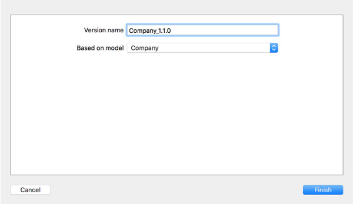

创建新版本模型文件

添加完成后，会发现之前的模型文件会变成一个文件夹，里面包含着多个模型文件。

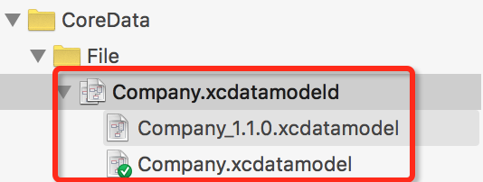

模型文件夹

在新建的模型文件中，里面的文件结构和之前的文件结构相同。后续的修改都应该在新的模型文件上，之前的模型文件不要再动了，在修改完模型文件后，记得**更新对应的模型类文件**。

基于新的模型文件，对`Employee`实体做如下修改，下面的版本迁移也以此为例。

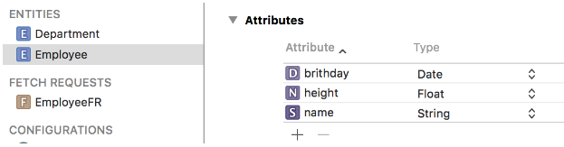

修改之前

添加一个`String`类型的属性，设置属性名为`sectionName`。

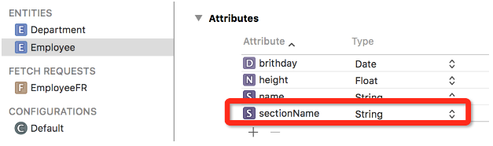

修改之后

此时还应该选中模型文件，设置当前模型文件的版本。这里选择将最新版本设置为刚才新建的`1.1.0版本`，模型文件设置工作完成。

```
Show The File Inspector -> Model Version -> Current 设置为最新版本。
```

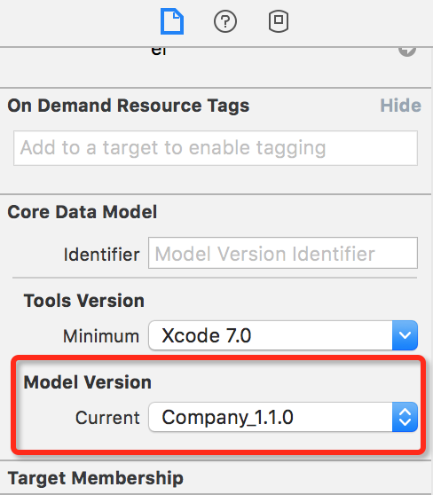

设置版本

对模型文件的设置已经完成了，接下来**系统还要知道我们想要怎样迁移数据**。在迁移过程中可能会存在多种可能，苹果将这个灵活性留给了我们完成。剩下要做的就是编写迁移方案以及细节的代码。

#### 轻量级版本迁移

轻量级版本迁移方案非常简单，大多数迁移工作都是由系统完成的，只需要告诉系统迁移方式即可。在持久化存储协调器(`PSC`)初始化对应的持久化存储(`NSPersistentStore`)对象时，设置`options`参数即可，参数是一个字典。`PSC`会根据传入的字典，自动推断版本迁移的过程。

###### 字典中设置的**key**：

* `NSMigratePersistentStoresAutomaticallyOption`设置为`YES`，`CoreData`会试着把低版本的持久化存储区迁移到最新版本的模型文件。
* `NSInferMappingModelAutomaticallyOption`设置为`YES`，`CoreData`会试着以最为合理地方式自动推断出源模型文件的实体中，某个属性到底对应于目标模型文件实体中的哪一个属性。

版本迁移的设置是在创建`MOC`时给`PSC`设置的，为了使代码更直观，下面只给出发生变化部分的代码，其他`MOC`的初始化代码都不变。

```
// 设置版本迁移方案
NSDictionary *options = @{NSMigratePersistentStoresAutomaticallyOption : @YES,
                                NSInferMappingModelAutomaticallyOption : @YES};

// 创建持久化存储协调器，并将迁移方案的字典当做参数传入
[coordinator addPersistentStoreWithType:NSSQLiteStoreType configuration:nil URL:[NSURL fileURLWithPath:dataPath] options:options error:nil];
```

##### 修改实体名

假设需要对已存在实体进行改名操作，需要将重命名后的实体`Renaming ID`，设置为之前的实体名。下面是`Employee`实体进行操作。

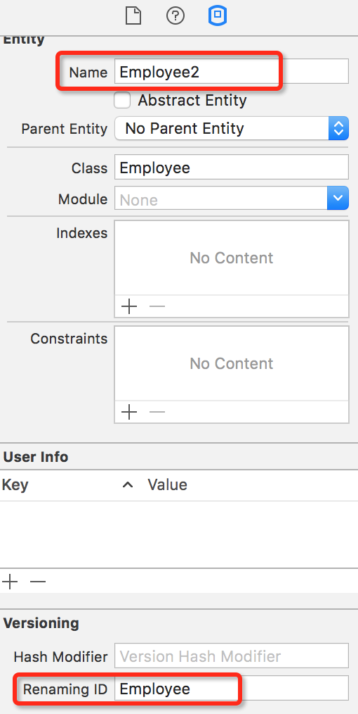

修改后再使用实体时，应该将实体名设为最新的实体名，这里也就是`Employee2`，而且数据库中的数据也会迁移到`Employee2`表中。

```
Employee2 *emp = [NSEntityDescription insertNewObjectForEntityForName:@"Employee2" inManagedObjectContext:context];
emp.name = @"lxz";
emp.brithday = [NSDate date];
emp.height = @1.9;
[context save:nil];
```

#### Mapping Model 迁移方案

轻量级迁移方案只是针对增加和改变实体、属性这样的一些简单操作，假设有更复杂的迁移需求，就应该使用`Xcode`提供的迁移模板(`Mapping Model`)。通过`Xcode`创建一个后缀为`.xcmappingmodel`的文件，这个文件是专门用来进行数据迁移用的，一些变化关系也会体现在模板中，**看起来非常直观**。

这里还以上面更改实体名，并迁移实体数据为例子，将`Employee`实体迁移到`Employee2`中。首先将`Employee`实体改名为`Employee2`，然后创建`Mapping Model`文件。

```
Command + N 新建文件 -> 选择 Mapping Model -> 选择源文件 Source Model -> 选择目标文件 Target Model -> 命名 Mapping Model 文件名 -> Create 创建完成。
```

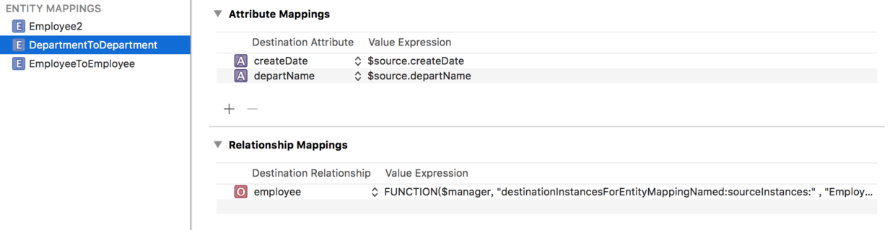

Mapping Model 文件

现在就创建好一个`Mapping Model`文件，文件中显示了实体、属性、`Relationships`，源文件和目标文件之间的关系。实体命名是`EntityToEntity`的方式命名的，实体包含的属性和关联关系，都会被添加到迁移方案中(`Entity Mapping`，`Attribute Mapping`，`Relationship Mapping`)。

在迁移文件的下方是源文件和目标文件的关系。

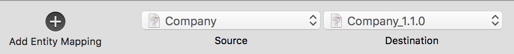

对应关系

在上面图中改名后的`Employee2`实体并没有迁移关系，由于是改名后的实体，系统还不知道实体应该怎样做迁移。所以选中`Mapping Model`文件的`Employee2 Mappings`，可以看到右侧边栏的`Source`为`invalid value`。因为要从`Employee`实体迁移数据过来，所以将其选择为`Employee`，迁移关系就设置完成了。

设置完成后，还应该将之前`EmployeeToEmployee`的`Mappings`删除，因为这个实体已经被`Employee2`替代，它的`Mappings`也被`Employee2 Mappings`所替代，否则会报错。

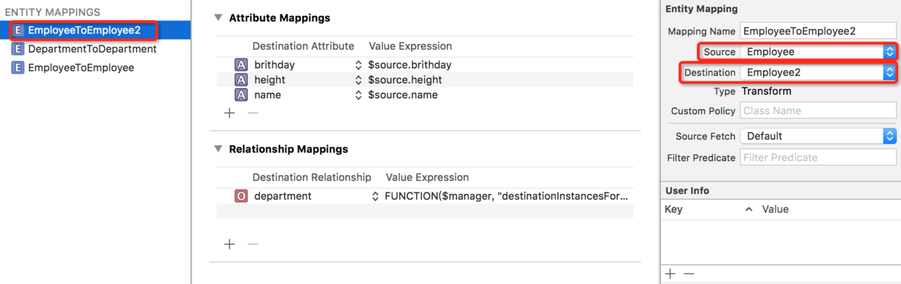

设置迁移关系

在实体的迁移过程中，还可以通过设置`Predicate`的方式，来简单的控制迁移过程。例如只需要迁移一部分指定的数据，就可以通过`Predicate`来指定。可以直接在右侧`Filter Predicate`的位置设置过滤条件，格式是`$source.height < 100`，`$source`代表数据源的实体。

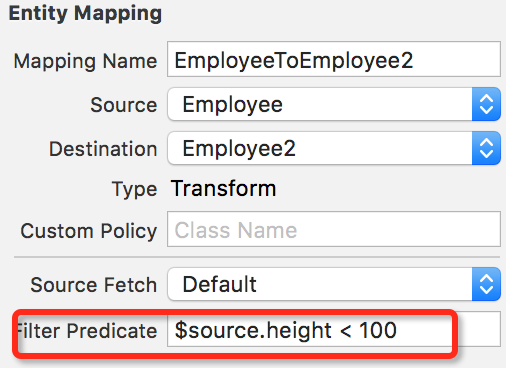

Filter Predicate


#### 更复杂的迁移需求

如果还存在更复杂的迁移需求，而且上面的迁移方式不能满足，可以考虑更复杂的迁移方式。假设要在迁移过程中，对迁移的数据进行更改，这时候上面的迁移方案就不能满足需求了。

对于上面提到的问题，在`Mapping Model`文件中选中实体，可以看到`Custom Policy`这个选项，选项对应的是`NSEntityMigrationPolicy`的子类，可以创建并设置一个子类，并重写这个类的方法来控制迁移过程。

```
- (BOOL)createDestinationInstancesForSourceInstance:(NSManagedObject *)sInstance entityMapping:(NSEntityMapping *)mapping manager:(NSMigrationManager *)manager error:(NSError **)error;
```

#### 版本迁移总结

版本迁移在需求的变更中肯定是要发生的，但是我们应该尽量避免这样的情况发生。在最开始设计模型文件数据结构的时候，就应该**设计一个比较完善并且容易应对变化的结构**，这样后面就算发生变化也不会对结构主体造成大的改动。

* * *

好多同学都问我有`Demo`没有，其实文章中贴出的代码组合起来就是个`Demo`。后来想了想，还是给本系列文章配了一个简单的`Demo`，方便大家运行调试，后续会给所有博客的文章都加上`Demo`。

`Demo`只是来辅助读者更好的理解文章中的内容，**应该博客结合`Demo`一起学习，只看`Demo`还是不能理解更深层的原理**。`Demo`中几乎每一行代码都会有注释，各位可以打断点跟着`Demo`执行流程走一遍，看看各个阶段变量的值。

