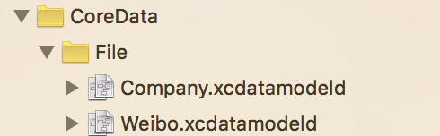

# MagicalRecord

在这篇文章中，主要讲一个`CoreData`第三方库-`MagicalRecord`。目前为止这个第三方在`Github`上有**9500+**的`Star`，是所有`CoreData`第三方库中使用最多、功能最全的。在文章的后面还会对`CoreData`做一个总结，以及对本系列所有文章做一个总结。

### MagicalRecord

`CoreData`是苹果自家推出的一个**持久化框架**，使用起来**更加面向对象**。但是在使用过程中会出现大量代码，而且`CoreData`学习曲线比较陡峭，如果掌握不好，在使用过程中很容易造成其他问题。

国外开发者开源了一个基于`CoreData`封装的第三方——`MagicalRecord`，就像是`FMDB`封装`SQLite`一样，`MagicalRecord`封装的`CoreData`，使得原生的`CoreData`更加容易使用。并且`MagicalRecord`降低了`CoreData`的使用门槛，不用去手动管理之前的`PSC`、`MOC`等对象。

根据`Github`上`MagicalRecord`的官方文档，`MagicalRecord`的优点主要有三条：

**1.** 清理项目中`CoreData`代码
**2.** 支持清晰、简单、一行式的查询操作
**3.** 当需要优化请求时，可以获取`NSFetchRequest`进行修改

#### 添加MagicalRecord到项目中

将`MagicalRecord`添加到项目中，和使用其他第三方一样，可以通过下载源码和`CocoaPods`两种方式添加。

**1.** 从**Github**下载[MagicalRecord](https://github.com/magicalpanda/MagicalRecord)源码，将源码直接拖到项目中，后续需要手动更新源码。

**2.** 也可以通过`CocoaPods`安装`MagicalRecord`，需要在`Podfile`中加入下面命令，后续只需要通过命令来更新。

```
pod "MagicalRecord"
```

在之前创建新项目时，通过勾选`"Use Core Data"`的方式添加`CoreData`到项目中，会在`AppDelegate`文件中生成大量`CoreData`相关代码。如果是大型项目，被占用的位置是很重要的。而对于`MagicalRecord`来说，只需要两行代码即可。

```
- (BOOL)application:(UIApplication *)application didFinishLaunchingWithOptions:(NSDictionary *)launchOptions {
     // 初始化CoreData堆栈，也可以指定初始化某个CoreData堆栈
     [MagicalRecord setupCoreDataStack];
     return YES;
 }

 - (void)applicationWillTerminate:(UIApplication *)application {
     // 在应用退出时，应该调用cleanUp方法
     [MagicalRecord cleanUp];
 }
```

`MagicalRecord`是支持`CoreData`的`.xcdatamodeld`文件的，使得`CoreData`这一优点可以继续使用。建立数据结构时还是像之前使用`CoreData`一样，通过`.xcdatamodeld`文件的方式建立。



模型文件


#### 支持iCloud

`CoreData`是支持`iCloud`的，`MagicalRecord`对`iCloud`相关的操作也做了封装，只需要使用`MagicalRecord+iCloud.h`类中提供的方法，就可以进行`iCloud`相关的操作。

例如下面是`MagicalRecord+iCloud.h`中的一个方法，需要将相关参数传入即可。

```
 + (void)setupCoreDataStackWithiCloudContainer:(NSString *)containerID localStoreNamed:(NSString *)localStore;
```

#### 创建上下文

`MagicalRecord`对上下文的管理和创建也比较全面，下面是`MagicalRecord`提供的部分创建和获取上下文的代码。因为是给`NSManagedObjectContext`添加的`Category`，可以直接用`NSManagedObjectContext`类调用，使用非常方便。

但是需要注意，虽然系统帮我们管理了上下文对象，对于**耗时操作仍然要放在后台线程中处理**，并且在**主线程中进行UI操作**。

```
+ [NSManagedObjectContext MR_context]  设置默认的上下文为它的父级上下文，并发类型为NSPrivateQueueConcurrencyType
+ [NSManagedObjectContext MR_newMainQueueContext]  创建一个新的上下文，并发类型为NSMainQueueConcurrencyType
+ [NSManagedObjectContext MR_newPrivateQueueContext]  创建一个新的上下文，并发类型为NSPrivateQueueConcurrencyType
+ [NSManagedObjectContext MR_contextWithParent:]  创建一个新的上下文，允许自定义父级上下文，并发类型为NSPrivateQueueConcurrencyType
+ [NSManagedObjectContext MR_contextWithStoreCoordinator:]  创建一个新的上下文，并允许自定义持久化存储协调器，并发类型为NSPrivateQueueConcurrencyType
+ [NSManagedObjectContext MR_defaultContext]  获取默认上下文对象，项目中最基础的上下文对象，并发类型是NSMainQueueConcurrencyType
```

#### 增删改查

`MagicalRecord`对`NSManagedObject`添加了一个`Category`，将增删改查等操作放在这个`Category`中，使得这些操作可以直接被`NSManagedObject`类及其子类调用。

**.1\. 增**
对于托管模型的创建非常简单，不需要像之前还需要进行上下文的操作，现在这都是`MagicalRecord`帮我们完成的。

```
 // 创建并插入到上下文中
 Employee *emp = [Employee MR_createEntity];
```

**.2\. 删**

```
 // 从上下文中删除当前对象
 [emp MR_deleteEntity];
```

**.3\. 改**

```
 // 获取一个上下文对象
 NSManagedObjectContext *defaultContext = [NSManagedObjectContext MR_defaultContext];

 // 在当前上下文环境中创建一个新的Employee对象
 Employee *emp = [Employee MR_createEntityInContext:defaultContext];
 emp.name      = @"lxz";
 emp.brithday  = [NSDate date];
 emp.height    = @1.7;

 // 保存修改到当前上下文中
 [defaultContext MR_saveToPersistentStoreAndWait];
```

**.4\. 查**

```
 // 执行查找操作，并设置排序条件
 NSArray *empSorted = [Employee MR_findAllSortedBy:@"height" ascending:YES];
```

#### 自定义NSFetchRequest

下面示例代码中，`Employee`根据已有的`employeeFilter`谓词对象，创建了`employeeRequest`请求对象，并将请求对象做修改后，从`MOC`中获取请求结果，实现自定义查找条件。

```
 NSPredicate *employeeFilter = [NSPredicate predicateWithFormat:@"name LIKE %@", @"*lxz*"];
 NSFetchRequest *employeeRequest = [Employee MR_requestAllWithPredicate:employeeFilter];
 employeeRequest.fetchOffset = 10;
 employeeRequest.fetchLimit = 10;
 NSArray *employees = [Employee MR_executeFetchRequest:employeeRequest];
```

#### 参数设置

**.1.** 可以通过修改`MR_LOGGING_DISABLED`预编译指令的值，控制`log`打印。

```
 #define MR_LOGGING_DISABLED 1
```

**.2.**`MagicalRecord`在`DEBUG`模式下，对模型文件发生了更改，并且没有创建新的模型文件版本。`MagicalRecord`默认会将旧的持久化存储删除，创建新的持久化存储。

#### MagicalRecord中文文档

`MagicalRecord`的使用方法还有很多，这里只是将一些比较常用的拿出来讲讲，其他就不一一讲解了。在`Github`上有国人翻译的`MagicalRecord`官方文档，翻译的非常全面，而且是实时更新的。

这篇文章关于`MagicalRecord`的部分，也是参考文章来写的，我这里就犯了个懒😓。。。

[MagicalRecord中文文档](https://github.com/ios122/MagicalRecord)

* * *

### CoreData优缺点总结

无论是什么东西，肯定不会是绝对完美的，`CoreData`也是如此。`CoreData`被设计出来后，对比其他本地持久化方案有自己独有的优势，也有比较严重的问题。

对于一个本地持久化方案的选取，还是要**根据公司业务需求**，来选择一个适合项目的方案，并没有哪个方案是万能的。

#### 优点

* 可以设置关联关系，也就是之前讲过的关联属性，关联属性可以和当前对象一起被`MOC`操作。
    例如`Company`关联一个`Person`对象，对`Company`进行操作时，也可以通过点语法从`Company`中获取`Person`，`Person`的修改会随着`Company`一起被持久化。
    如果用`SQLite`实现起来是很麻烦的，但`CoreData`可以很容易的完成，这也是`CoreData`更加面向对象的一种体现。

* **更加面向对象**，将之前`Model`层的表示和持久化合二为一。把数据库的交互和对象的转换封装起来，使用时不需要接触到任何`SQLite`相关的代码，直接使用托管对象即可。

* **开发效率比较快**，可以很快的封装一个基于`CoreData`实现的`Model`层，而不需要太多的代码就可以实现。

* 可以很好的防范`SQL注入`的问题。对于`SQLite`来说，如果是用`FMDB`并且用`?占位符`，也可以防范`SQL注入`的问题。

* **可视化化效果好且结构清晰**。将模型文件内部的结构，以及实体之间的对应关系等，以可视化的结构展现出来。

* 对`OC`原生编程支持非常好，支持`keyPath`操作方式。例如设置`NSPredicate`查找条件时，可以使用`keyPath`的点语法设置属性。而其他持久化存储对于这点支持的不太好，需要编写很复杂的查找条件，看起来也不太好理解。
    毕竟是`Apple`自家推出的，所以对`OC`融合度比较高，可以很好的配合和使用`OC`对象。

* **设置一对一或一对多的关系**，设置关系后做存储和查询也非常方便，这是非常便于开发的。如果对于性能没有苛刻的要求，并且**持久化对象之间关系比较复杂**，比较推荐使用`CoreData`。

#### 缺点

* 灵活性不如`SQLite`，`CoreData`是对`SQLite`的一个封装，上层不能直接对数据库进行操作。处理任何数据都要按照`CoreData`内部的实现逻辑执行，而不能自定义执行逻辑，**对执行逻辑没有可控性**。

* **进行大量数据处理时比较吃力**，性能明显低于直接操作`SQLite`数据库，而且内存占用非常大，需要手动做内存控制。
    当执行一个操作时涉及的数据比较多，需要**将所有相关的托管对象加载到内存中**，而且中间还涉及到对象的转换等操作。这样对性能和内存的消耗都是非常大的，和涉及到的数据量成正比。

* 因为`CoreData`底层是用`SQLite`实现的，可以在`CoreData`的基础上，直接编写`SQL语句`对数据库进行操作。但是**并不推荐这样做**，在一个项目中应该只有一种持久化的主体方案。而且如果这两种方式混用的话，对于后期维护是非常困难的。
    如果出现这样的需求，**最好直接去用SQLite**。

* **CoreData入门门槛比较高**，很难很好的掌握。
    很多人都说`CoreData`不好用，这个原因很大一部分都是因为使用方式的问题。`CoreData`框架学习难度比较大，导致很多人都只是简单的使用`CoreData`，这些用法很多都是不合理的，很多的高级用法并没有用到。

* * *

### 写在最后

到目前为止`CoreData`系列的六篇文章就都写完了，文章中可能存在一些没有注意的问题，还请各位提出。博客中包括`CoreData`在内的所有文章永久更新维护，会不断将新知识添加到对应的文章中，也会对落后的文章进行重写。

在第一篇文章中也说到，我接触`CoreData`时间也不是很长，这系列文章更像是我学习的一个总结。但是我确实是很认真的在写，文章内容也是检查了很多遍，防止错字或者语法问题。知识点总结的还是比较全面的，在后续我还会更深入的学习`CoreData`，也可能会推出后续文章。

许多人对于`CoreData`有很多意见，认为`CoreData`有各种各样的问题，这并不是空穴来风。在我学习`CoreData`的过程中，也发现`CoreData`确实存在诸多问题，例如查询性能略差、灵活性等。所以在使用`CoreData`的时候，还是根据公司业务需求来权衡是否使用`CoreData`。

* * *

好多同学都问我有`Demo`没有，其实文章中贴出的代码组合起来就是个`Demo`。后来想了想，还是给本系列文章配了一个简单的`Demo`，方便大家运行调试，后续会给所有博客的文章都加上`Demo`。

`Demo`只是来辅助读者更好的理解文章中的内容，**应该博客结合`Demo`一起学习，只看`Demo`还是不能理解更深层的原理**。`Demo`中几乎每一行代码都会有注释，各位可以打断点跟着`Demo`执行流程走一遍，看看各个阶段变量的值。

