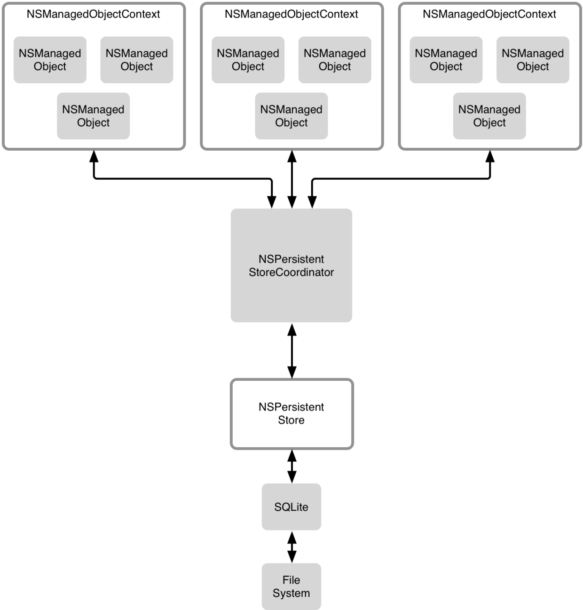
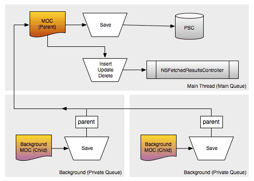
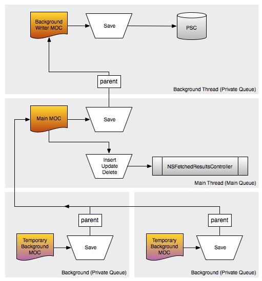

# 多线程

在本篇文章中主要讲`CoreData`的多线程，其中会包括并发队列类型、线程安全等技术点。我对多线程的理解可能不是太透彻，文章中出现的问题还请各位指出。在之后公司项目使用`CoreData`的过程中，我会将其中遇到的多线程相关的问题更新到文章中。

在文章的最后，会根据我对`CoreData`多线程的学习，以及在工作中的具体使用，给出一些关于多线程结构的设计建议，各位可以当做参考。

### MOC并发队列类型

在`CoreData`中`MOC`是支持多线程的，可以在创建`MOC`对象时，指定其并发队列的类型。当指定队列类型后，系统会将操作都放在指定的队列中执行，如果指定的是私有队列，系统会创建一个新的队列。但这都是**系统内部的行为**，我们并**不能获取这个队列**，队列由系统所拥有，**并由系统将任务派发到这个队列中执行的**。

###### NSManagedObjectContext并发队列类型:

* **NSConfinementConcurrencyType** : 如果使用`init`方法初始化上下文，默认就是这个并发类型。这个枚举值是**不支持多线程的**，从名字上也体现出来了。
* **NSPrivateQueueConcurrencyType** : 私有并发队列类型，操作都是在子线程中完成的。
* **NSMainQueueConcurrencyType** : 主并发队列类型，如果涉及到`UI`相关的操作，应该考虑使用这个枚举值初始化上下文。

其中`NSConfinementConcurrencyType`类型在`iOS9`之后已经被苹果废弃，不建议使用这个`API`。使用此类型创建的`MOC`，调用某些比较新的`CoreData`的`API`可能会导致崩溃。

### MOC多线程调用方式

在`CoreData`中**MOC不是线程安全的**，在多线程情况下使用`MOC`时，不能简单的将`MOC`从一个线程中传递到另一个线程中使用，这并不是`CoreData`的多线程，而且会出问题。对于`MOC`多线程的使用，苹果给出了自己的解决方案。

在创建的`MOC`中使用多线程，无论是私有队列还是主队列，都应该采用下面两种多线程的使用方式，**而不是自己手动创建线程**。调用下面方法后，系统内部会将任务派发到不同的队列中执行。可以在不同的线程中调用`MOC`的这两个方法，这个是允许的。

```
- (void)performBlock:(void (^)())block            异步执行的block，调用之后会立刻返回。
- (void)performBlockAndWait:(void (^)())block     同步执行的block，调用之后会等待这个任务完成，才会继续向下执行。
```

下面是多线程调用的示例代码，在多线程的环境下执行`MOC`的`save`方法，就是将`save`方法放在`MOC`的`block`体中异步执行，其他方法的调用也是一样的。

```
[context performBlock:^{
    [context save:nil];
}];
```

但是需要注意的是，这两个`block`方法不能在`NSConfinementConcurrencyType`类型的`MOC`下调用，这个类型的`MOC`是不支持多线程的，只支持其他两种并发方式的`MOC`。

### 多线程的使用

在业务比较复杂的情况下，需要进行大量数据处理，并且还需要涉及到`UI`的操作。对于这种复杂需求，如果都放在主队列中，**对性能和界面流畅度都会有很大的影响**，导致用户体验非常差，降低屏幕`FPS`。对于这种情况，可以采取多个`MOC`配合的方式。

`CoreData`多线程的发展中，在`iOS5`经历了一次比较大的变化，之后可以更方便的使用多线程。从`iOS5`开始，支持设置`MOC`的`parentContext`属性，通过这个属性可以设置`MOC`的`父MOC`。下面会针对`iOS5`之前和之后，分别讲解`CoreData`的多线程使用。

尽管现在的开发中早就不兼容`iOS5`之前的系统了，但是作为了解这里还是要讲一下，而且这种同步方式在`iOS5`之后也是可以正常使用的，也有很多人还在使用这种同步方式，下面其他章节也是同理。

#### iOS5之前使用多个MOC

在`iOS5`之前实现`MOC`的多线程，可以创建多个`MOC`，多个`MOC`使用同一个`PSC`，并让多个`MOC`实现数据同步。通过这种方式不用担心`PSC`在调用过程中的线程问题，`MOC`在使用`PSC`进行`save`操作时，会对`PSC`进行**加锁**，等当前加锁的`MOC`执行完操作之后，其他`MOC`才能继续执行操作。

每一个`PSC`都对应着一个持久化存储区，`PSC`知道存储区中数据存储的数据结构，而`MOC`需要使用这个`PSC`进行`save`操作的实现。


-------


多线程结构


这样做有一个问题，当一个`MOC`发生改变并持久化到本地时，系统并不会将其他`MOC`缓存在内存中的`NSManagedObject`对象改变。所以这就需要我们在`MOC`发生改变时，将其他`MOC`数据更新。

根据上面的解释，在下面例子中创建了一个主队列的`mainMOC`，主要用于`UI`操作。一个私有队列的`backgroundMOC`，用于除`UI`之外的耗时操作，两个`MOC`使用的同一个`PSC`。

```
// 获取PSC实例对象
- (NSPersistentStoreCoordinator *)persistentStoreCoordinator {

    // 创建托管对象模型，并指明加载Company模型文件
    NSURL *modelPath = [[NSBundle mainBundle] URLForResource:@"Company" withExtension:@"momd"];
    NSManagedObjectModel *model = [[NSManagedObjectModel alloc] initWithContentsOfURL:modelPath];

       // 创建PSC对象，并将托管对象模型当做参数传入，其他MOC都是用这一个PSC。
    NSPersistentStoreCoordinator *PSC = [[NSPersistentStoreCoordinator alloc] initWithManagedObjectModel:model];

    // 根据指定的路径，创建并关联本地数据库
    NSString *dataPath = NSSearchPathForDirectoriesInDomains(NSDocumentDirectory, NSUserDomainMask, YES).lastObject;
    dataPath = [dataPath stringByAppendingFormat:@"/%@.sqlite", @"Company"];
    [PSC addPersistentStoreWithType:NSSQLiteStoreType configuration:nil URL:[NSURL fileURLWithPath:dataPath] options:nil error:nil];

    return PSC;
}

// 初始化用于本地存储的所有MOC
- (void)createManagedObjectContext {

    // 创建PSC实例对象，其他MOC都用这一个PSC。
    NSPersistentStoreCoordinator *PSC = self.persistentStoreCoordinator;

    // 创建主队列MOC，用于执行UI操作
    NSManagedObjectContext *mainMOC = [[NSManagedObjectContext alloc] initWithConcurrencyType:NSMainQueueConcurrencyType];
    mainMOC.persistentStoreCoordinator = PSC;

    // 创建私有队列MOC，用于执行其他耗时操作
    NSManagedObjectContext *backgroundMOC = [[NSManagedObjectContext alloc] initWithConcurrencyType:NSPrivateQueueConcurrencyType];
    backgroundMOC.persistentStoreCoordinator = PSC;

    // 通过监听NSManagedObjectContextDidSaveNotification通知，来获取所有MOC的改变消息
    [[NSNotificationCenter defaultCenter] addObserver:self selector:@selector(contextChanged:) name:NSManagedObjectContextDidSaveNotification object:nil];
}

// MOC改变后的通知回调
- (void)contextChanged:(NSNotification *)noti {
    NSManagedObjectContext *MOC = noti.object;
    // 这里需要做判断操作，判断当前改变的MOC是否我们将要做同步的MOC，如果就是当前MOC自己做的改变，那就不需要再同步自己了。
    // 由于项目中可能存在多个PSC，所以下面还需要判断PSC是否当前操作的PSC，如果不是当前PSC则不需要同步，不要去同步其他本地存储的数据。
    [MOC performBlock:^{
        // 直接调用系统提供的同步API，系统内部会完成同步的实现细节。
        [MOC mergeChangesFromContextDidSaveNotification:noti];
    }];
}
```

在上面的`Demo`中，创建了一个`PSC`，并将其他`MOC`都关联到这个`PSC`上，这样所有的`MOC`执行本地持久化相关的操作时，都是通过同一个`PSC`进行操作的。并在下面添加了一个通知，这个通知是监听所有`MOC`执行`save`操作后的通知，并在通知的回调方法中**进行数据的合并**。

#### iOS5之后使用多个MOC

在`iOS5`之后，`MOC`可以设置`parentContext`，一个`parentContext`可以拥有多个`ChildContext`。在`ChildContext`执行`save`操作后，会将操作`push`到`parentContext`，由`parentContext`去完成真正的`save`操作，而`ChildContext`所有的改变都会被`parentContext`所知晓，这解决了之前`MOC`手动同步数据的问题。

需要注意的是，在`ChildContext`调用`save`方法之后，此时并没有将数据写入存储区，还需要调用`parentContext`的`save`方法。因为`ChildContext`并不拥有`PSC`，`ChildContext`也不需要设置`PSC`，所以需要`parentContext`调用`PSC`来执行真正的`save`操作。也就是只有拥有`PSC`的`MOC`执行`save`操作后，才是真正的执行了写入存储区的操作。

```
- (void)createManagedObjectContext {
    // 创建PSC实例对象，还是用上面Demo的实例化代码
    NSPersistentStoreCoordinator *PSC = self.persistentStoreCoordinator;

    // 创建主队列MOC，用于执行UI操作
    NSManagedObjectContext *mainMOC = [[NSManagedObjectContext alloc] initWithConcurrencyType:NSMainQueueConcurrencyType];
    mainMOC.persistentStoreCoordinator = PSC;

    // 创建私有队列MOC，用于执行其他耗时操作，backgroundMOC并不需要设置PSC
    NSManagedObjectContext *backgroundMOC = [[NSManagedObjectContext alloc] initWithConcurrencyType:NSPrivateQueueConcurrencyType];
    backgroundMOC.parentContext = mainMOC;

    // 私有队列的MOC和主队列的MOC，在执行save操作时，都应该调用performBlock:方法，在自己的队列中执行save操作。
    // 私有队列的MOC执行完自己的save操作后，还调用了主队列MOC的save方法，来完成真正的持久化操作，否则不能持久化到本地
    [backgroundMOC performBlock:^{
        [backgroundMOC save:nil];

        [mainMOC performBlock:^{
            [mainMOC save:nil];
        }];
    }];
}
```

上面例子中创建一个主队列的`mainMOC`，来完成`UI`相关的操作。创建私有队列的`backgroundMOC`，处理复杂逻辑以及数据处理操作，在实际开发中可以根据需求创建多个`backgroundMOC`。需要注意的是，在`backgroundMOC`执行完`save`方法后，又在`mainMOC`中执行了一次`save`方法，这步是很重要的。

### iOS5之前进行数据同步

就像上面章节中讲到的，在`iOS5`之前存在多个`MOC`的情况下，一个`MOC`发生更改并提交存储区后，其他`MOC`并不知道这个改变，其他`MOC`和本地存储的**数据是不同步的**，所以就涉及到数据同步的问题。

进行数据同步时，会遇到多种复杂情况。例如只有一个`MOC`数据发生了改变，其他`MOC`更新时并没有对相同的数据做改变，这样不会造成冲突，可以直接将其他`MOC`更新。

如果在一个`MOC`数据发生改变后，其他`MOC`对相同的数据做了改变，而且改变的结果不同，这样在同步时就会造成冲突。下面将会按照这两种情况，分别讲一下不同情况下的冲突处理方式。

#### 简单情况下的数据同步

简单情况下的数据同步，是针对于只有一个`MOC`的数据发生改变，并提交存储区后，其他`MOC`更新时并没有对相同的数据做改变，只是单纯的同步数据的情况。

在`NSManagedObjectContext`类中，根据不同操作定义了一些通知。在一个`MOC`发生改变时，其他地方可以通过`MOC`中定义的通知名，来获取`MOC`发生的改变。在`NSManagedObjectContext`中定义了下面三个通知：

* **NSManagedObjectContextWillSaveNotification** `MOC`将要向存储区存储数据时，调用这个通知。在这个通知中**不能获取**发生改变相关的`NSManagedObject`对象。
* **NSManagedObjectContextDidSaveNotification** `MOC`向存储区存储数据后，调用这个通知。在这个通知中**可以获取**改变、添加、删除等信息，以及相关联的`NSManagedObject`对象。
* **NSManagedObjectContextObjectsDidChangeNotification** 在`MOC`中任何一个托管对象发生改变时，调用这个通知。例如修改托管对象的属性。

通过监听`NSManagedObjectContextDidSaveNotification`通知，获取所有`MOC`的`save`操作。

```
[[NSNotificationCenter defaultCenter] addObserver:self selector:@selector(settingsContext:) name:NSManagedObjectContextDidSaveNotification object:nil];
```

不需要在通知的回调方法中，编写代码对比被修改的托管对象。`MOC`为我们提供了下面的方法，只需要将通知对象传入，**系统会自动同步数据**。

```
- (void)mergeChangesFromContextDidSaveNotification:(NSNotification *)notification;
```

下面是通知中的实现代码，但是需要注意的是，由于**通知是同步执行**的，在通知对应的回调方法中所处的线程，和发出通知的`MOC`执行操作时所处的线程是**同一个线程**，也就是系统`performBlock:`回调方法分配的线程。

所以其他`MOC`在通知回调方法中，需要注意使用`performBlock:`方法，并在`block`体中执行操作。

```
- (void)settingsContext:(NSNotification *)noti {
    [context performBlock:^{
        // 调用需要同步的MOC对象的merge方法，直接将通知对象当做参数传进去即可，系统会完成同步操作。
        [context mergeChangesFromContextDidSaveNotification:noti];
    }];
}
```

#### 复杂情况下的数据同步

在一个`MOC`对本地存储区的数据发生改变，而其他`MOC`也对同样的数据做了改变，这样后面执行`save`操作的`MOC`就会冲突，并导致后面的`save`操作失败，这就是复杂情况下的数据合并。

这是因为每次一个`MOC`执行一次`fetch`操作后，**会保存一个本地持久化存储的状态**，当下次执行`save`操作时会**对比这个状态和本地持久化状态是否一样**。如果一样，则代表本地没有其他`MOC`对存储发生过改变；如果不一样，则代表本地持久化存储被其他`MOC`改变过，这就是造成冲突的根本原因。

对于这种冲突的情况，可以通过`MOC`对象指定解决冲突的方案，通过`mergePolicy`属性来设置方案。`mergePolicy`属性有下面几种可选的策略，默认是`NSErrorMergePolicy`方式，这也是唯一一个有`NSError`返回值的选项。

* **NSErrorMergePolicy** : 默认值，当出现合并冲突时，返回一个`NSError`对象来描述错误，而`MOC`和持久化存储区**不发生改变**。
* **NSMergeByPropertyStoreTrumpMergePolicy** : 以本地存储为准，使用本地存储来覆盖冲突部分。
* **NSMergeByPropertyObjectTrumpMergePolicy** : 以`MOC`的为准，使用`MOC`来覆盖本地存储的冲突部分。
* **NSOverwriteMergePolicy** : 以`MOC`为准，用`MOC`的所有`NSManagedObject`对象覆盖本地存储的对应对象。
* **NSRollbackMergePolicy** : 以本地存储为准，`MOC`所有的`NSManagedObject`对象被本地存储的对应对象所覆盖。

上面五种策略中，除了第一个`NSErrorMergePolicy`的策略，其他四种中`NSMergeByPropertyStoreTrumpMergePolicy`和`NSRollbackMergePolicy`，以及`NSMergeByPropertyObjectTrumpMergePolicy`和`NSOverwriteMergePolicy`看起来是重复的。

其实它们并不是冲突的，这四种策略的不同体现在，**对没有发生冲突的部分应该怎么处理**。`NSMergeByPropertyStoreTrumpMergePolicy`和`NSMergeByPropertyObjectTrumpMergePolicy`对没有冲突的部分，未冲突部分数据并不会受到影响。而`NSRollbackMergePolicy`和`NSOverwriteMergePolicy`则是无论是否冲突，直接全部替换。

**题外话：**
对于`MOC`的这种合并策略来看，有木有感觉到`CoreData`解决冲突的方式，和`SVN`解决冲突的方式特别像。。。

### 线程安全

无论是`MOC`还是托管对象，都不应该在其他`MOC`的线程中执行操作，**这两个API都不是线程安全的**。但`MOC`可以在其他`MOC`线程中调用`performBlock:`方法，切换到自己的线程执行操作。

如果其他`MOC`想要拿到托管对象，并在自己的队列中使用托管对象，这是不允许的，托管对象是不能直接传递到其他`MOC`的线程的。但是可以通过获取`NSManagedObject`的`NSManagedObjectID`对象，在其他`MOC`中通过`NSManagedObjectID`对象，从持久化存储区中获取`NSManagedObject`对象，这样就是允许的。`NSManagedObjectID`是线程安全，并且可以跨线程使用的。

可以通过`MOC`获取`NSManagedObjectID`对应的`NSManagedObject`对象，例如下面几个`MOC`的`API`。

```
NSManagedObject *object = [context objectRegisteredForID:objectID];
NSManagedObject *object = [context objectWithID:objectID];
```

通过`NSManagedObject`对象的`objectID`属性，获取`NSManagedObjectID`类型的`objectID`对象。

```
NSManagedObjectID *objectID = object.objectID;
```

### CoreData多线程结构设计

上面章节中写的大多都是怎么用`CoreData`多线程，在掌握多线程的使用后，就可以根据公司业务需求，设计一套`CoreData`多线程结构了。对于多线程结构的设计，应该本着**尽量减少主线程压力**的角度去设计，将所有**耗时操作都放在子线程**中执行。

对于具体的设计我根据不同的业务需求，给出两种设计方案的建议。

#### 两层设计方案

在项目中多线程操作比较简单时，可以创建一个主队列`mainMOC`，和一个或多个私有队列的`backgroundMOC`。将所有`backgroundMOC`的`parentContext`设置为`mainMOC`，采取这样的两层设计一般就能够满足大多数需求了。



两层设计方案


将耗时操作都放在`backgroundMOC`中执行，`mainMOC`负责所有和`UI`相关的操作。所有和`UI`无关的工作都交给`backgroundMOC`，在`backgroundMOC`对数据发生改变后，调用`save`方法会将改变`push`到`mainMOC`中，再由`mainMOC`执行`save`方法将改变保存到存储区。

代码这里就不写了，和上面例子中设置`parentContext`代码一样，主要讲一下设计思路。

#### 三层设计方案

但是我们发现，上面的`save`操作最后还是由`mainMOC`去执行的，`backgroundMOC`只是负责处理数据。虽然`mainMOC`只执行`save`操作并不会很耗时，但是如果`save`涉及的数据比较多，这样还是会对性能造成影响的。

虽然**客户端很少涉及到大量数据处理**的需求，但是假设有这样的需求。可以考虑在两层结构之上，给`mainMOC`之上再添加一个`parentMOC`，这个`parentMOC`也是私有队列的`MOC`，用于处理`save`操作。



三层设计方案


这样`CoreData`存储的结构就是三层了，最底层是`backgroundMOC`负责处理数据，中间层是`mainMOC`负责`UI`相关操作，最上层也是一个`backgroundMOC`负责执行`save`操作。这样就将影响`UI`的所有**耗时操作全都剥离到私有队列中**执行，使性能达到了很好的优化。

需要注意的是，执行`MOC`相关操作时，不要阻塞当前主线程。所有`MOC`的操作应该是异步的，无论是子线程还是主线程，尽量少的使用同步`block`方法。

#### MOC同步时机

设置`MOC`的`parentContext`属性之后，`parent`对于`child`的改变是知道的，但是`child`对于`parent`的改变是不知道的。苹果这样设计，应该是为了更好的数据同步。

```
Employee *emp = [NSEntityDescription insertNewObjectForEntityForName:@"Employee" inManagedObjectContext:backgroundMOC];
emp.name = @"lxz";
emp.brithday = [NSDate date];
emp.height = @1.7f;

[backgroundMOC performBlock:^{
    [backgroundMOC save:nil];
    [mainMOC performBlock:^{
        [mainMOC save:nil];
    }];
}];
```

在上面这段代码中，`mainMOC`是`backgroundMOC`的`parentContext`。在`backgroundMOC`执行`save`方法前，`backgroundMOC`和`mainMOC`都不能获取到`Employee`的数据，在`backgroundMOC`执行完`save`方法后，自身上下文发生改变的同时，也将改变`push`到`mainMOC`中，`mainMOC`也具有了`Employee`对象。

所以在`backgroundMOC`的`save`方法执行时，是对内存中的上下文做了改变，当拥有`PSC`的`mainMOC`执行`save`方法后，是对本地存储区做了改变。

* * *

好多同学都问我有`Demo`没有，其实文章中贴出的代码组合起来就是个`Demo`。后来想了想，还是给本系列文章配了一个简单的`Demo`，方便大家运行调试，后续会给所有博客的文章都加上`Demo`。

`Demo`只是来辅助读者更好的理解文章中的内容，**应该博客结合`Demo`一起学习，只看`Demo`还是不能理解更深层的原理**。`Demo`中几乎每一行代码都会有注释，各位可以打断点跟着`Demo`执行流程走一遍，看看各个阶段变量的值。

